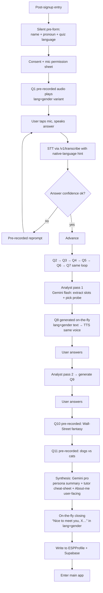

# Voice Onboarding Quiz — Tech Design

Status: **v1.2 — restructured: silent pre-form (name + pronoun + quiz language) → 7 standard voice questions → 2 adaptive → 2 finale. Gendered TTS/copy per pronoun. Awaiting per-line thumbs-up on §5 wording.**
Owner: onboarding submodule.
Scope: a self-contained voice chat quiz that runs the first time a user opens the app after sign-in, produces a rich personalization summary, and writes it back into the existing `ESPProfile`. Ships as an isolated Swift submodule under `EMOMORENEISA/EMOMORENEISA/EMOMORENEISA/Onboarding/` so it does not touch the current chat pipeline.

## 0. Resolved decisions (from §12 answers)

- **Q1 — Question language.** Multi-language quiz. v1 ships **English + Ukrainian**. Same engine, translated question bank. Language is picked from the existing `LocalizationManager.shared.language` (already app-wide). Adding a new language later = adding a new translated question bank + rendering assets in that language, no engine change.
- **Q2 — Wording.** Draft in §5, awaiting final thumbs-up.
- **Q3 — Tone.** Anchor to the existing intro-slide voice (playful, informal `ти` in UK / first-name terms in EN, lightly ironic). **Voice must be the exact same voice used elsewhere** (dog bubble, intro slides). Guaranteed by pinning `activeVoiceTag()` from `./server/src/voicecache.js` and refusing to run onboarding on mismatch.
- **Q4 — Depth.** Medium-deep. Actively probes for family, pets, best friend if any signal shows up in Q1–Q5.
- **Q5 — Closing.** Synthesized on-the-fly with the confirmed name, same voice → seamless.
- **Q6 — Mic UX.** Tap-to-start / tap-to-stop. Live equalizer bars around the mic while recording (Whisper Flow / Claude Voice / ChatGPT Voice style). Reuses `./EMOMORENEISA/EMOMORENEISA/EMOMORENEISA/Chat/Audio/VoiceWaveformView.swift` (already animates from live level) and upgrades to a taller multi-bar equalizer.
- **Q7 — Reasoning model.** Gemini (already has an API key + call path on the proxy — no new provider cost/setup). Split by latency budget:
  - Probes Q6/Q7/Q8: **`gemini-2.5-flash`** (env `MODEL_ONBOARDING_PROBE`). Runs 3× mid-quiz, must return in < 1.5 s.
  - Final synthesis: **`gemini-2.5-pro`** (env `MODEL_ONBOARDING_SYNTHESIS`). Runs once, quality matters most, ~2 s latency masked by the closing playback.
  - Cost line added to the pricing sheet under Gemini text tokens.
- **Q8 — Visual style.** Same visual language as the tutor chat (colors, background, typography). Foreground character = a set of **Professor Madrid dog illustrations** posed as if he's the one asking each question, cross-faded per question in the background. Same character as the avatar / intro slides.
- **Q9 — Redo screen.** NOT shown right after quiz. Lives in the user's profile as a new **"About me"** section:
  - Under-the-hood: full `OnboardingProfile` (sharp, raw, uncensored observations) — used by the tutor.
  - User-facing: a *shorter, smoothed, friendly* paraphrase generated by the same synthesis call and stored as `aboutMeUserFacing: String`. The user sees this smoothed version; a "re-take specific slot" affordance appears here (v1.5 stretch, not blocking v1 ship).
- **Q10 — Cheat-sheet injection.** Extends `ESPProfile.profileDigest` (which is already inlined into every system prompt via `PromptBuilder.topicSystemPrompt` at `./EMOMORENEISA/EMOMORENEISA/EMOMORENEISA/Chat/LLM/PromptBuilder.swift:13`). No new injection path — we reuse the existing "dynamic user context" mechanism you were remembering. Added to the digest: `narrativeSummary` (2 lines max in the digest) + top 6 highest-confidence slot key-values.

## 0.1 Structure (v1.2)

**Phase A — Silent pre-form (no voice, plain SwiftUI form, ≤ 15 s).** Collected before any audio plays:

1. **Name** — single text field, first name only.
2. **Pronoun** — 3-way picker: **He / She / They**. Locks the gendered TTS + copy variant used everywhere in the app (chat, notifications, tutor system prompt) from this point on. Stored on `ESPProfile` as `pronoun: "he" | "she" | "they"`.
3. **Quiz language** — segmented control: **EN / UK** (more later). Locks `quizLanguage` for the whole session; independent of `LocalizationManager.shared.language` so a user with UK UI can still take the EN quiz if they prefer.

The pre-form is a hard gate — Continue is disabled until all three are set. No skip.

**Phase B — Voice quiz.** 7 standard pre-recorded questions → 2 adaptive → 2 finale pre-recorded, closing on-the-fly. Progress dots: `● ● ● ● ● ● ● ○ ○ ● ●` (finale dots visible from the start so the user knows the end is fixed; adaptive dots reveal as probing begins).

| # | Kind        | Basis                        | Rendering        |
|---|-------------|------------------------------|------------------|
| Q1| standard    | name + city warm-up          | pre-recorded     |
| Q2| standard    | what they do                 | pre-recorded     |
| Q3| standard    | why Spanish                  | pre-recorded     |
| Q4| standard    | how long / how learning      | pre-recorded     |
| Q5| standard    | self-rating + improvement goal | pre-recorded   |
| Q6| standard    | daily routine                | pre-recorded     |
| Q7| standard    | (moved into §5 below — extra warm probe) | pre-recorded |
| Q8| adaptive    | analyst on Q1–Q7             | on-the-fly TTS   |
| Q9| adaptive    | analyst on Q1–Q8             | on-the-fly TTS   |
|Q10| finale      | Wall-Street / TV fantasy     | pre-recorded     |
|Q11| finale      | dogs-vs-cats provocation     | pre-recorded     |
| — | closing     | "Nice to meet you, [NAME]…"  | on-the-fly TTS   |

**Fallback:** exactly one pre-recorded fallback line (a warm "small random thing about you" probe) is used if EITHER adaptive analyst pass fails or times out. Simpler than v1.1's F1/F2/F3.

## 0.2 Gender / pronoun engine

Every user-facing string and every TTS line ships in **N gender variants per quiz language**:

- **EN:** 1 variant (English second-person is genderless; the `you` form covers he/she/they without inflection). Pronoun is only used in third-person copy (e.g., tutor referring to the user in analytics view or shared summaries) — 3 variants there.
- **UK:** 3 variants (`he` / `she` / `they`). Ukrainian inflects gender in past tense, adjectival endings, and short-form possessives. Because Ukrainian has no native singular-they, the `they` variant is written in a **gender-agnostic paraphrase register** (impersonal / present-tense / infinitive constructions that dodge the gendered endings), NOT plural `ви` (which would collide with the formal-you register and break the intimate `ти`-tone of the quiz).
- **Every new language added later must ship all 3 variants up front.** The asset renderer script enforces this by refusing to build if any `{lang}/{gender}/*.aac` slot is missing.

**Downstream propagation:** `ESPProfile.pronoun` is inlined into every chat system prompt via `PromptBuilder.topicSystemPrompt` (already touches `profileDigest` — we add a new line `"User pronoun: <he|she|they>. Address the user with the matching Ukrainian/Spanish endings; never mix genders mid-message."`). Streets, notifications, achievements copy — all read from a new `GenderedString` helper that picks the right variant at render time.

**Asset paths:** `Onboarding/Assets/{lang}/{gender}/qN.aac` — for EN, `{gender}` is always `neutral` (single folder); for UK, three folders `he/`, `she/`, `they/`.

---

## 1. Goal

Collect enough personal, emotional, and pragmatic signal in **~90–150 seconds of speaking time** to let the tutor talk to the user like *a fun friend who already knows them a lot*, referencing their pet's name, their kid's age, their city, their why, etc.

Success is measured by:

1. **Coverage** — at least 5 of the 8 "hyper-personalization slots" are filled with confidence ≥ 0.7 after the quiz (slots defined in §4).
2. **Recall in chat** — within the first 5 tutor turns after onboarding, the tutor references at least 2 personalization slots naturally (verified in QA log).
3. **Drop-off** — < 15 % of users abandon the quiz before Q4.
4. **Perceived vibe** — post-quiz thumbs-up rate ≥ 70 %.

## 2. Non-goals (v1)

- Multi-language quiz *questions*. The **questions are pre-recorded in one language** (see §12 Q1). Only the user's *answers* can be in any native language.
- Editing / re-taking individual questions after finishing (v1 is take-once, redo-all). Editing lands in v2.
- Text-only fallback UI. Voice-first only. Accessibility fallback in §11.
- Piping onboarding audio through the analyst pipeline (`ProfileAnalystService`) — onboarding has its own extractor.

## 3. User experience flow



**Screen anatomy per question:**

- Full-bleed dark background, one animated waveform bubble in the center that pulses while the *tutor* speaks (reuses `VoiceWaveformView`).
- Subtitle strip at the bottom shows the question text *only after* the audio finishes playing (so the user actually listens the first time).
- Big circular mic button appears when audio ends. Long-press-to-hold OR tap-to-toggle (see §12 Q6).
- Live level meter around the mic while recording.
- After STT returns, a small ghosted text bubble shows the transcript for 1.5 s ("*Got it: my dog is Rocky*") — user can tap "not what I said" to redo.
- Progress dots at top: `● ● ● ○ ○ ○` — but only 4 dots visible in the standard phase, dots 5 & 6 appear once probing begins (avoids revealing dynamic length upfront).

## 4. Personalization slots (target schema)

These are the fields the whole pipeline is optimizing for. They map into `ESPProfile.lifeNotes` + a new structured `onboardingProfile` blob (see §7).

| Slot key            | Type            | Source                   | Example                           |
|---------------------|-----------------|--------------------------|-----------------------------------|
| `name`              | String          | pre-form + Q1 confirm    | "Andrii"                          |
| `pronoun`           | Enum he/she/they| pre-form                 | "he"                              |
| `quizLanguage`      | Enum en/uk      | pre-form                 | "uk"                              |
| `city` + `country`  | String + String | Q1                       | "Kraków, Poland"                  |
| `occupation`        | String          | Q2 (or probe)            | "PhD student in linguistics"      |
| `whyLearningSpanish`| String (short)  | Q3                       | "moving to Valencia next summer"  |
| `learningGoal`      | Enum-ish        | Q4 derived               | travel / work / partner / hobby   |
| `currentLearningStack` | [String]     | Q4                       | ["Duolingo", "Netflix in ES"]     |
| `selfRatedLevel`    | Enum            | Q5                       | "gets by / knows the basics"      |
| `learningPriority`  | Enum            | Q5                       | vocab_grammar / speaking_without_fear |
| `preferredLearningStyle` | Enum       | derived Q4+Q5+Q6         | audio-first / visual / conversational |
| `dailyRoutineNote`  | String (short)  | Q6                       | "gym at 6, remote work, cooks late" |
| `livesWith`         | Enum            | Q6                       | alone / partner / kids / roommates |
| `personOrPetSeed`   | String          | Q7                       | "wife Marta"  or  "dog Rocky"     |
| `pets`              | [{species, name}] | Q7 or probe            | [{dog, "Rocky"}]                  |
| `family`            | {partner?, kids:[{name?, age?}]} | Q6/Q7/probe | {partner: "Marta", kids:[{age:3}]}|
| `bestFriendName`    | String          | Q7 or probe              | "Piotr"                           |
| `hobbies`           | [String]        | Q6 derived               | ["climbing", "cooking"]           |
| `funFact`           | String          | derived                  | "makes homemade kimchi"           |
| `cityFlavor`        | String (LLM synthesized) | LLM enrichment  | "pierogi, Wawel dragon, Rynek"    |
| `fantasyPayoff`     | String          | Q10                      | "would move to Buenos Aires"      |
| `petAffinity`       | Enum            | Q11                      | dogs / cats / both / neither      |

Every slot has an associated `confidence: Float` and `source: "asked" | "inferred" | "enriched"`.

## 5. Question wording — v1.2 (pending per-line thumbs-up)

Constraints:
- 4–12 seconds spoken.
- Warm, playful, precise. **Short.** No preamble, no "hey — really glad you're here" bloat (user feedback on v1.1). Get to the question.
- Informal `ти` in UK / first-name in EN. Same voice archetype as intro slides.
- Copyright-safe wording, original.
- User answers in their native language.
- **EN:** 1 variant. **UK:** 3 variants (`he` / `she` / `they`); where a line is naturally gender-neutral (2sg present tense / no adjectives / no past-tense verbs) all three variants are identical and are rendered once and symlinked at asset-render time.

Legend: **[H]** = for `he`, **[S]** = for `she`, **[T]** = for `they`. `≡` after **[H]** means the she/they lines are identical to the he line (no gendered token in that sentence).

---

### Standard block (Q1 → Q7)

**Q1 — Name + place (4–6 s)**
Opens: `name` (confirms/replaces the pre-form value), `city`, `country`.
- **EN:** *"So — what should I call you, and what country and city are you in these days?"*
- **UK [H] ≡:** *"То як тебе звати, і в якій країні та місті ти зараз живеш?"*

**Q2 — What you do (4–6 s)**
Opens: `occupation`, hints at `family` (kids), `hobbies`.
- **EN:** *"What do you do in life — working, studying, raising kids?"*
- **UK [H] ≡:** *"Чим ти займаєшся в житті — працюєш, вчишся, ростиш дітей?"*

**Q3 — Why Spanish (6–8 s)**
Opens: `whyLearningSpanish`, `learningGoal`. Probes for a specific person (partner / relatives / friend) as high-value signal.
- **EN:** *"Why do you want to learn Spanish? For work? To connect with people — with anyone in particular? Or just for fun, or for school?"*
- **UK [H] ≡:** *"Чому ти хочеш вивчити іспанську? Для роботи? Щоб спілкуватися з людьми — з кимось конкретно? Чи просто для задоволення, чи для навчання?"*

**Q4 — How long / how (6–8 s)**
Opens: `currentLearningStack`, coarse `level`.
- **EN:** *"How long have you been learning Spanish? Do you go to a school, use other apps, or are you just starting out and not sure where to begin?"*
- **UK [H] ≡:** *"Як довго ти вчиш іспанську? Ходиш до школи, користуєшся іншими додатками, чи це самий початок і ти ще не знаєш, з чого стартувати?"*

**Q5 — Self-rating + improvement goal (8–10 s)**
Opens: `preferredLearningStyle`, `selfRatedLevel`, sharp signal on `learningPriority` (vocab-grammar vs speaking-without-fear).
- **EN:** *"How would you rate your Spanish — not compared to other people, but compared to future-you? What would you like to improve most: learn new words and grammar, or start speaking without fear?"*
- **UK [H]:** *"Як ти оцінюєш свою іспанську — не порівняно з іншими, а порівняно з майбутнім собою? Що ти хотів би покращити насамперед — вивчити нові слова й граматику, чи почати говорити без страху?"*
- **UK [S]:** *"…Що ти хотіла б покращити насамперед…"*
- **UK [T]:** *"…Що хочеться покращити насамперед — вивчити нові слова й граматику, чи почати говорити без страху?"* (impersonal `хочеться` sidesteps the gendered past-conditional.)

**Q6 — Daily routine (8–10 s)**
Opens: `family` (alone vs partner), `occupation` detail, `hobbies`.
- **EN:** *"Tell me one sentence about your daily routine. What do you do in the morning? Do you live alone or with someone? Where do you work, and what do you like to do in your free time?"*
- **UK [H] ≡:** *"Розкажи одним реченням про свій звичайний день. Що ти робиш зранку? Живеш сам чи з кимось? Де ти працюєш і чим любиш займатися у вільний час?"*
- **UK [S]:** *"…Живеш сама чи з кимось?…"* (only `сам→сама` differs.)
- **UK [T]:** *"…Живеш на самоті чи з кимось?…"* (impersonal noun form dodges gender.)

**Q7 — Warm probe: a person / animal that matters (5–7 s)**
Explicitly asks for a personal noun (person or pet) so the adaptive analyst has a rich seed before it fires. Opens: `pets` OR `bestFriendName` OR `family` (whichever the user offers first).
- **EN:** *"One more — tell me about one person or animal in your life who makes it better. Just a name and one thing about them."*
- **UK [H] ≡:** *"Ще одне — розкажи про одну людину або тваринку у твоєму житті, з ким тобі краще. Просто ім'я і одну річ про них."*

---

### Adaptive block (Q8 → Q9) — generated on-the-fly per §6

Both questions are produced by the analyst pipeline in the user's chosen quiz language + pronoun variant. §6.1 prompts pass `quizLanguage` and `pronoun` explicitly so the model returns already-gendered text. TTS then synthesizes with the same voice tag.

---

### Finale block (Q10 → Q11)

**Q10 — Fantasy projection (6–8 s)**
Elicits emotional `whyLearningSpanish` payoff. Captures the aspirational-me picture that the tutor uses as a motivational hook later.
- **EN:** *"Imagine you already know Spanish well enough to perform on national TV, or sell pens on Wall Street. What would change in your life?"*
- **UK [H] ≡:** *"Уяви, що ти вже говориш іспанською настільки добре, щоб виступати на національному телебаченні або продавати ручки на Волл-стріт. Що б змінилося у твоєму житті?"*

**Q11 — Dogs vs. cats provocation (5–7 s)** — deliberately absurd, closes the quiz on a laugh. Extracts `petAffinity` slot for the tutor to reference forever after.
- **EN:** *"And the last one — the hardest. Listen carefully and don't get me wrong… who do you like more, dogs or cats? Dogs, right? Please tell me you like dogs more."*
- **UK [H] ≡:** *"І останнє — найважче. Слухай уважно і не зрозумій мене неправильно… кого ти любиш більше — собак чи котів? Собак, правда? Скажи, будь ласка, що любиш собак більше."*

---

### Closing (on-the-fly TTS, personalized)

- **EN:** *"Alright — [NAME]. Really nice to meet you. This is going to be a good one, I promise. Ready when you are."*
- **UK [H]:** *"Ну що ж, [NAME]. Дуже приємно познайомитись. Буде цікаво, обіцяю. Починаємо, коли ти готовий."*
- **UK [S]:** *"…коли ти готова."*
- **UK [T]:** *"…коли скажеш."* (impersonal — no participle.)

### Reprompt (pre-recorded, ≤ 2× per question)

- **EN:** *"Sorry — didn't quite catch that. Try one more time?"*
- **UK [H] ≡:** *"Пробач — не зовсім розчув. Спробуй ще раз?"* (Note: `розчув` is masculine past — see [S]/[T].)
- **UK [S]:** *"Пробач — не зовсім розчула. Спробуй ще раз?"* — wait, the *speaker* here is the tutor (Professor Madrid, male dog), not the user, so the past-tense verb refers to the tutor's own gender and stays masculine `розчув` regardless of the user's pronoun. **Correction: reprompt is single-variant per language.** The user-pronoun switch never affects lines the tutor says about *himself*. Keep only the `[H]` UK line.
- **UK (single):** *"Пробач — не зовсім розчув. Спробуй ще раз?"*

### Fallback (pre-recorded, single line, used if EITHER adaptive analyst pass fails)

- **EN:** *"Tell me something small and totally random about yourself — a pet, a weird hobby, your best friend's name, whatever pops into your head."*
- **UK [H] ≡:** *"Розкажи щось маленьке й геть випадкове про себе — про домашнього улюбленця, дивне хобі, ім'я найкращого друга — що першим спаде на думку."*

---

**Asset count for the renderer script:**
- EN neutral: 7 (Q1–Q7) + 2 (Q10–Q11) + 1 (reprompt) + 1 (fallback) = **11 files**.
- UK per gender × 3 genders: same 11 files, but many are `≡` between genders — after dedup, EN=11, UK actually renders ≈ **11 + 6 gendered-only variants = 17 files** (Q5 has 3 variants; Q6 has he=they-different-from-she but H≡T ambiguity — see per-line notes; closing has 3). Script dedupes via content-hash so identical lines are rendered once and symlinked into the per-gender folders. Manifest records the mapping.

## 6. Adaptive Q8, Q9 — probing logic

Two cumulative analyst passes. Each pass gets all prior transcripts + `quizLanguage` + `pronoun` + `nativeLanguage` hint + a running `covered_slot_families` set to prevent duplicate probing. All output text is returned in the correct language + gender variant, already ready for TTS.

**Analyst pass 1 (after Q7) → generates Q8.** Inputs: Q1–Q7 transcripts + pre-form (name, pronoun, language). Output JSON:

```json
{
  "extracted_slots": { ... partial fill of §4 ... },
  "probe_topic": "pets" | "family" | "learning_stack_detail" | "hobby" | "best_friend" | "work_context" | "trip_plans" | "pain_point",
  "probe_topic_family": "personal_noun" | "learning_context" | "goal_context",
  "probe_reason": "user mentioned dog barking in background of Q3",
  "next_question_text": "Wait — is that a dog I hear? Tell me about them, what's their name?",
  "next_question_language": "en" | "uk",
  "estimated_duration_seconds": 5
}
```

Topic-selection priority (encoded in the analyst prompt):

1. **Concrete personal noun** leaked in Q1–Q7 (pet mentioned in Q7, kid mentioned in Q2/Q6, partner mentioned in Q3/Q6, best friend named) → probe *that* thing. Highest emotional payoff.
2. Else if `learningGoal = travel` and destination named in Q3 → probe trip plans + local knowledge.
3. Else if `learningGoal = partner/family` → probe that person.
4. Else if Q4 revealed a strong **pain point** ("tried Duolingo, hated it", "boring teacher") → probe what *would* work better.
5. Else if `occupation = student` → probe field of study + peer group.
6. Fallback → deeper detail on `hobbies` / `currentLearningStack`.

**Analyst pass 2 (after Q8) → generates Q9.** Same output shape. Constraints in the prompt:

- Q9 **must** cover a `probe_topic_family` different from Q8's. Enforced by passing `covered_slot_families` back in.
- If Q8 opened a rich vein (e.g. pet name given), Q9 pivots to a different family (e.g. hobbies).
- Q9 is the last conversational question before the pre-recorded finale (Q10/Q11), so lean slightly warmer / softer.

**Fallback if either analyst pass fails / times out (> 4 s):** substitute the single pre-recorded `fallback.aac` from §5. Log to `GameLogger`. The other pass still runs.

## 6.1 Reasoning prompts — full text

All prompts live server-side in `./server/src/onboardingPrompts.js` so we can tune them without shipping a new app build. Language of the *generated question* always matches `quizLanguage` (locked at quiz start from `LocalizationManager.shared.language`); we pass it explicitly in the prompt so the model does not guess from the user's answer.

### 6.1.1 Voice/tone contract (shared header for every probe call)

```
You are the writer for "Professor Madrid", a warm, playful, mildly ironic Spanish tutor
who talks to the learner like a fun older sibling — never condescending, never interview-y.

Your ONLY job in this call is to write ONE (1) next spoken question to ask the learner,
in {LANGUAGE_HUMAN_NAME}, that will be sent through the app's text-to-speech in the
same voice you already use everywhere else. Constraints for the question you write:

- 4 to 14 seconds when spoken aloud (roughly 12–35 words).
- One question mark, one question. No compound questions ("A and B and C?").
- Second person, informal register. In Ukrainian use "ти", never "Ви".
- Reference something the learner ACTUALLY SAID in a previous answer when it feels
  natural — quote the fragment lightly. Never invent facts. If you have no signal, ask
  something small and universal instead.
- No praise. No filler ("great answer!", "amazing!"). No emojis.
- No jargon: never say "proficiency", "objectives", "assessment", "personalization".
- Never mention the quiz, the number of questions, or the app.
- Warm, one small joke max, only if it fits. Silence beats a forced joke.

You MUST return ONLY valid JSON matching this schema, no markdown, no prose:
{
  "extracted_slots":       { <partial slot fill, see slot catalog below> },
  "probe_topic":           "pets" | "family" | "learning_stack_detail" | "hobby"
                         | "best_friend" | "work_context" | "trip_plans" | "pain_point"
                         | "fun_fact",
  "probe_topic_family":    "personal_noun" | "learning_context" | "goal_context",
  "probe_reason":          "<one sentence, English, why you chose this topic>",
  "next_question_text":    "<the actual question to speak, in {LANGUAGE_HUMAN_NAME}>",
  "next_question_language": "{LANGUAGE_CODE}",
  "estimated_duration_seconds": <int 4-14>
}
```

Slot catalog is a mirror of §4 with an added `confidence: 0.0-1.0`. The model is
instructed to leave slots absent rather than guess.

### 6.1.2 Distillation instructions (per pass)

**Pass 1 (after Q7 → generates Q8):** appended to the shared header.

```
You have received the transcripts of 7 opening answers plus the pre-form values
(name, pronoun, quiz language). Distill the following before writing the next question:

1) Fill `extracted_slots` from what the learner actually said. Do not invent.
2) Choose exactly ONE `probe_topic`, in this priority order (stop at the first hit):
   a. A concrete personal noun was mentioned or clearly implied in Q1–Q7 (pet, kid,
      partner, best friend, sibling, roommate — Q7 is a rich source) → probe THAT
      thing. Highest emotional payoff.
   b. The learner named a specific travel destination or "moving to X" → probe trip
      plans, timing, or something concrete about X.
   c. Q4 revealed a specific pain point ("tried Duolingo and it was too slow",
      "boring teacher", "verb tables killed me") → probe what would actually work.
   d. Learner is a student and named a field → probe the field or peer group.
   e. Fallback: dig deeper on `hobbies` or `currentLearningStack`.
3) Write the next question in the {LANGUAGE_HUMAN_NAME} language, in the gendered
   variant matching pronoun = "{PRONOUN}". For Ukrainian: if pronoun is "he" use
   masculine past/adjectival endings; if "she" use feminine; if "they" use impersonal
   / present-tense paraphrase (avoid gendered past). Never use plural formal "ви".
4) The question MUST reference the specific fragment that made you pick this topic
   ("you mentioned <X> — …"). Keep it short and warm.

Return ONLY the JSON object described above.
```

**Pass 2 (after Q8 → generates Q9):** header + transcripts of Q1–Q8 + the constraint:

```
The previous adaptive question already covered probe_topic_family = "{PREV_FAMILY}".
You MUST choose a DIFFERENT probe_topic_family this turn. This is a hard rule.

Priority order for pass 2:
  1. If the previous answer opened a rich vein, pivot to a NEW slot family that gives
     us different signal (e.g. if Q8 was about a pet, Q9 is NOT about the pet — go
     for hobbies, or a friend, or their learning environment).
  2. Otherwise apply the same 1a–1e priority as pass 1, but skip any topic whose
     `probe_topic_family` equals "{PREV_FAMILY}".
  3. If everything is already covered, ask about `fun_fact` (something small, weird,
     specific — the kind of thing you'd tell a friend at the bar).

Q9 is the last conversational question before two pre-recorded finale questions
(fantasy projection, dogs-vs-cats). Lean slightly softer / warmer so the tone
transitions smoothly into the finale.

Same gender / language rules as Pass 1.

Return ONLY the JSON object.
```

### 6.1.3 Synthesis prompt (runs ONCE after Q11, generates the persisted profile — inputs are the 11-question transcript block + pre-form values + `pronoun`)

Model: `gemini-2.5-pro`. Runs in parallel with the personalized closing playback.

```
You are the writer for "Professor Madrid". You just finished an 8-question voice
onboarding with the learner. Produce a JSON object with FOUR text fields, plus a
final flat slot map for programmatic use. Never invent facts. Every claim you make
must come from the transcripts.

Learner's UI language / native language: {LANGUAGE_HUMAN_NAME} ({LANGUAGE_CODE}).
Target study language: Spanish.
Transcripts of all 8 questions + answers are below.

Produce EXACTLY this JSON, no markdown, no commentary:
{
  "slots":                { <full flat slot map per §4 with confidences> },
  "tutor_cheat_sheet":    "<English, 6–10 bullet lines starting with '• '. Each bullet
                           is a sharp, specific fact the tutor can use to talk to the
                           learner like a friend. Include: name, city+country, life
                           context (job/student/parent/etc), why-Spanish, learning
                           style + pain point to avoid, and every named personal noun
                           (pet name, kid name+age, partner name, best friend name).
                           No prose intro, no closing summary, bullets only.>",
  "narrative_summary":    "<English, 2 short paragraphs. Sharp, honest, uncensored
                           friend-view of who this person is and what will actually
                           make Spanish stick for them. This is TUTOR-ONLY and never
                           shown to the user.>",
  "about_me_user_facing": "<In {LANGUAGE_HUMAN_NAME}, 3–5 short sentences, second
                           person, warm. A smoothed, kind, high-level ‘this is what
                           Professor Madrid knows about you’ summary. NO sharp
                           observations, NO deductions the user didn't state. Skip
                           anything that could feel intrusive.>",
  "city_flavor":          "<English, ONE sentence, one concrete detail about
                           {city} the tutor can drop naturally in conversation. Skip
                           if city is unknown.>"
}
```

The client stores all four fields on `OnboardingProfile`. `tutor_cheat_sheet` gets
inlined into `ESPProfile.profileDigest` (top of it) so it flows through every future
`PromptBuilder.topicSystemPrompt` call. `about_me_user_facing` is shown in Profile →
About me. `narrative_summary` is never rendered — it goes into the tutor system prompt
verbatim on session start.

### 6.1.4 Voice pipeline for dynamic Q6/Q7/Q8/closing

**Identical to chat TTS. No new voice code path.**

1. Client receives `next_question_text` from the probe endpoint.
2. Client calls `ProxyClient.tts(text: next_question_text, context: "onboarding")`.
   Same call the chat uses today.
3. Server routes through `synthesizeVoice()` in `./server/src/providers.js`:
   Gemini `Charon` primary → Google Cloud `es-ES-Chirp3-HD-Achird` fallback → OpenAI
   `alloy` last-resort fallback. Cache key includes `activeVoiceTag()`.
4. Response is AAC bytes, decoded by `OnboardingAudioPlayer` and played through the
   same `AVAudioPlayer` pipeline as `TTSService`.

Because the pre-rendered standard-question assets (§10) were also generated by hitting
`/v1/tts` at build time, and the cache key on both is bound to `activeVoiceTag()`,
Q1 through Q8 through the closing come out of byte-identical voice config. If server
voice config drifts (`activeVoiceTag()` mismatch vs `manifest.json` shipped in the
bundle), the client aborts asset playback and synthesizes ALL questions on-the-fly so
the session stays internally consistent — never mixes a stale-voice asset with a
fresh-voice dynamic question.

## 7. Data model

New file: `Onboarding/OnboardingModels.swift`.

```swift
struct OnboardingSlot: Codable {
    var value: String
    var confidence: Double
    var source: String  // "asked" | "inferred" | "enriched"
}

struct OnboardingPet: Codable { var species: String; var name: String? }
struct OnboardingKid: Codable { var name: String?; var age: Int? }
struct OnboardingFamily: Codable { var partner: String?; var kids: [OnboardingKid] }

struct OnboardingProfile: Codable {
    var name: OnboardingSlot?
    var city: OnboardingSlot?
    var country: OnboardingSlot?
    var occupation: OnboardingSlot?
    var whyLearningSpanish: OnboardingSlot?
    var learningGoal: OnboardingSlot?      // enum-ish string
    var currentLearningStack: [String]
    var preferredLearningStyle: OnboardingSlot?
    var pets: [OnboardingPet]
    var family: OnboardingFamily?
    var bestFriendName: OnboardingSlot?
    var hobbies: [String]
    var funFact: OnboardingSlot?
    var cityFlavor: OnboardingSlot?
    var narrativeSummary: String          // 2-3 paragraph friend-view, sharp/uncensored, TUTOR-ONLY
    var tutorCheatSheet: String           // 8-12 bullet points, LLM-optimized for the tutor system prompt
    var aboutMeUserFacing: String         // shorter, smoothed, friendly paraphrase shown in Profile → "About me"
    var rawTranscripts: [String]          // Q1..Q8 answers as spoken (per §12 Q9, kept for re-take flow later)
    var quizLanguage: String              // "en" | "uk" — locked at quiz start from LocalizationManager
    var completedAt: Date
    var quizVersion: Int                  // bump on any prompt/wording change
}

struct OnboardingQuestion: Codable, Identifiable {
    let id: String            // "q1_name", "q2_place", "q3_days", "q4_why", "q5_tried", "q6_probe", "q7_probe", "q8_probe", "closing"
    let index: Int
    let assetName: String?    // non-nil → pre-recorded asset in Onboarding/Assets/<lang>/
    let dynamicText: String?  // non-nil → synthesize on-the-fly via /v1/tts
    let displaySubtitle: String
    let expectAnswer: Bool    // false for closing
}
```

`ESPProfile` gets one new optional field: `onboarding: OnboardingProfile?` (behind a `CodingKeys` addition, backward-compatible). `profileDigest` (in `./EMOMORENEISA/EMOMORENEISA/EMOMORENEISA/Chat/Profile/StudentProfile.swift:137`) is extended to inline the top of `tutorCheatSheet` — this is the "dynamic user context" mechanism you were remembering (already flows through `PromptBuilder.topicSystemPrompt` every message, no new plumbing required).

**Server-side mirror table (Supabase):** new column `onboarding_profile jsonb` on the `profiles` table, synced by `SupabaseSyncService.updateProfileV2()`. Also a new table `onboarding_events(user_id uuid, quiz_language text, transcripts jsonb, extracted jsonb, created_at timestamptz)` to enable off-line re-synthesis if we improve the reasoning prompt later.

## 8. Backend / proxy changes

Two new endpoints on the proxy (Node, `server/src/`):

1. **`POST /v1/onboarding/probe`** — inputs: prior transcripts + native language. Runs a strong reasoning model (candidate: `gpt-5-3-codex` or `gpt-5-4` — see §12 Q7 — reasoning quality > speed here, budget ~2 sec). Returns the JSON in §6.
2. **`POST /v1/onboarding/synthesize`** — inputs: all 6 transcripts + extracted slots. Runs strong reasoning model. Returns `narrativeSummary`, `tutorCheatSheet`, `cityFlavor` enrichment (LLM writes a 1-sentence flavor line for the given city — no external API call), `funFact`, final `learningGoal`. Server does **not** hit any external "city facts" API; the LLM's own knowledge is sufficient and avoids extra latency.

Both endpoints are **not billed** (utility class, like `analyst`). They live behind Supabase JWT like everything else. Rate-limit: 1 quiz-completion per user per 24 h server-side to prevent replay abuse.

TTS for on-the-fly Q5/Q6 uses **the existing `/v1/tts` endpoint** with `context: "onboarding"`. This is the **critical voice-match constraint**: the exact same `MODEL_TTS_GEMINI` + `TTS_GEMINI_VOICE` combo used to pre-render assets must be pinned server-side. To guarantee this we introduce:

- A build-time script `scripts/render-onboarding-assets.js` (in `server/scripts/`) that generates the 4 standard questions + 2 fallback probes + closing template + apology reprompt using the *same* proxy `/v1/tts` call, then commits the resulting AAC files into `EMOMORENEISA/EMOMORENEISA/EMOMORENEISA/Onboarding/Assets/`.
- The script's manifest records the `activeVoiceTag()` used. The client refuses to run onboarding if the current server voice tag (returned via a new `GET /v1/voice/current` endpoint) does not match the manifest's tag — falls back to on-the-fly synthesis for all questions, logging a warning. This guarantees seamlessness even if voice config drifts.

## 9. Name splicing in the closing line

Two options — I need §12 Q5 to decide, but the recommended one:

**Recommended: synthesize the whole closing on-the-fly.** After Q6, we already have the confirmed name. We call `/v1/tts` for the full closing sentence with the name inlined. Same voice guarantees seamlessness with the mic UI. Cost: +1 TTS call, ~1.2 s. Trivial.

Alternative: concatenate a pre-recorded "Alright" prefix + on-the-fly `<name>. Really nice to meet you...` — more complex, saves nothing.

## 10. Onboarding submodule layout

```
EMOMORENEISA/EMOMORENEISA/EMOMORENEISA/Onboarding/
├── OnboardingCoordinator.swift        // state machine (Q1→Q5 standard, Q6→Q8 adaptive, closing)
├── OnboardingViewModel.swift          // @Observable, drives the view
├── OnboardingView.swift               // SwiftUI root — matches chat visual language
├── OnboardingBackgroundView.swift     // cross-fading Professor Madrid illustrations (§0 Q8)
├── OnboardingEqualizerView.swift      // multi-bar live equalizer around mic (§0 Q6, Whisper-Flow style)
├── OnboardingModels.swift             // structs from §7
├── OnboardingQuestionBank.swift       // per-language (EN/UK) map: 5 standard + 3 fallback + closing template + reprompt
├── OnboardingAnalyst.swift            // wraps /v1/onboarding/probe (×3) + /synthesize
├── OnboardingAudioPlayer.swift        // plays asset (from bundle) OR TTS bytes (via ProxyClient.tts)
├── OnboardingRecorderAdapter.swift    // reuses AudioRecorder, adds silence-based auto-stop
├── OnboardingStore.swift              // persists intermediate state so a mid-quiz kill resumes (SwiftData)
├── AboutMeView.swift                  // profile-embedded read-only card showing aboutMeUserFacing (§0 Q9)
└── Assets/                            // pre-rendered .aac + per-language / per-gender manifests
    ├── en/
    │   └── neutral/
    │       ├── q1_name_place.aac
    │       ├── q2_what_you_do.aac
    │       ├── q3_why_spanish.aac
    │       ├── q4_how_long.aac
    │       ├── q5_selfrate_improve.aac
    │       ├── q6_daily_routine.aac
    │       ├── q7_person_or_pet.aac
    │       ├── q10_fantasy.aac
    │       ├── q11_dogs_vs_cats.aac
    │       ├── reprompt.aac
    │       ├── fallback.aac
    │       └── manifest.json          // { voiceTag, textPerQuestion, renderedAt, contentHashes }
    ├── uk/
    │   ├── he/
    │   │   └── (same 11 file slots; identical lines symlinked from shared_/ per manifest)
    │   ├── she/
    │   │   └── (same layout, feminine variants of Q5/Q6/closing)
    │   ├── they/
    │   │   └── (same layout, impersonal paraphrase variants)
    │   └── shared_/                   // deduped bodies for lines that are identical across genders
    │       └── q1_name_place.aac … etc
    └── dog/
        ├── professor_madrid_01.png    // bundled real photos of Professor Madrid (see R2)
        ├── professor_madrid_02.png
        └── professor_madrid_03.png
```

Zero imports from `Chat/Messages/` or `Chat/LLM/`. Only imports: `Chat/Network/ProxyClient`, `Chat/Audio/AudioRecorder`, `Chat/Auth/*`, `Chat/Profile/StudentProfile`, `Localization/LocalizationManager`. This is the "separate submodule" constraint.

**Entry point:** `AuthState` (existing) gains a computed `needsOnboarding: Bool` = `profile?.onboarding == nil` (no `hasSkippedOnboarding` flag — the quiz is mandatory, see R5). The root view (currently `ModeSelectorView` per `./EMOMORENEISA/EMOMORENEISA/EMOMORENEISA/Home/ModeSelectorView.swift`) full-screen-covers with `OnboardingView` when true and the cover cannot be dismissed until `OnboardingProfile` is written. **Profile view** gets a new tappable "About me" row that presents `AboutMeView` (v1 read-only; v1.5 adds re-take affordance).

## 11. Edge cases, accessibility, resilience

- **Mic permission denied** — show a friendly full-screen explainer that asks once more ("we really need this — the whole quiz is voice"). If still denied, switch the same 8 questions to a keyboard-typed fallback UI (subtitle appears immediately, big text field replaces the mic button; analyst passes run on typed text). No "skip" affordance — the quiz still runs, just typed. Only if the user force-quits do we defer; on next launch we re-enter onboarding.
- **STT returns empty / low-confidence** — one gentle re-prompt (pre-recorded `reprompt.aac`: *"Sorry — didn't quite catch that. Try one more time?"*). After 2 empty answers on same question, skip that slot and continue.
- **Analyst pass fails / times out (> 4 s)** — fall back to pre-recorded generic probe (§6). Log to `GameLogger`.
- **User backgrounds the app mid-quiz** — `OnboardingStore` persists (SwiftData) after each answered question. On relaunch, resume at the next question.
- **Voice-tag mismatch** — synthesize *all* questions on-the-fly instead of using assets (see §8). Never mix rendered-vs-live within one session.
- **Accessibility** — VoiceOver reads the subtitle; the mic button has an "Answer question" accessibility label; a "Type instead" secondary button appears after 8 s of silence for users who can't/won't speak (goes through same STT-less path with keyboard input).
- **Age-gating / minors** — v1 does not ask for age; we do not store DOB. If the user volunteers a kid's age, we store the kid's age, not theirs. No compliance new-territory here.
- **Privacy** — raw audio is *not* uploaded or stored server-side. Only transcripts + extracted slots + LLM-synthesized summary. Audio is deleted from the temp dir at end of quiz. Shown in the consent sheet.
- **Silence auto-stop** — mic auto-stops after 1.2 s of below-threshold audio *after* at least 0.5 s of speech was detected. Prevents cut-offs of hesitant speakers.

## 12. Residual open questions (final blockers before build)

The §12 questions from v0.1 are all resolved — see §0. What remains:

**R1. Final wording approval for the 5 standard questions + reprompt + 3 fallbacks + closing** (EN + UK). Please give a per-question thumbs-up or a proposed edit. This is the last hard blocker.

**R2. Professor Madrid dog illustrations. — RESOLVED.** User attached 3 real photos of Professor Madrid (the dog). Converted from HEIC → PNG at 1024 px wide and bundled at:
- `./EMOMORENEISA/EMOMORENEISA/EMOMORENEISA/Onboarding/Assets/dog/professor_madrid_01.png` (~1.0 MB)
- `./EMOMORENEISA/EMOMORENEISA/EMOMORENEISA/Onboarding/Assets/dog/professor_madrid_02.png` (~950 KB)
- `./EMOMORENEISA/EMOMORENEISA/EMOMORENEISA/Onboarding/Assets/dog/professor_madrid_03.png` (~1.1 MB)

**Note on "SVG or whatever so we don't miss the format":** SVG is a vector format meant for line/shape art (logos, icons). These are photographic images of a real dog — an SVG conversion would either (a) embed the pixels as a base64 blob inside SVG XML (larger file, zero benefit) or (b) auto-trace into flat vector shapes (unrecognizable poster-style output, loses the dog). PNG at 1024 px @ ~1 MB is the correct production format for photographic backgrounds on iOS: sharp on all current retina devices, ships lossless, supports transparency if we later cut out a background. If you want smaller, we can output HEIC / WebP (~300 KB each) but PNG is broader Xcode-catalog-compatible. Renaming to `.imageset` catalog entries happens in the "Swift submodule scaffolding" step.

Q1–Q5 background pose mapping (default; cross-faded 0.35 s between questions):
- Q1 → `professor_madrid_01.png`
- Q2 → `professor_madrid_02.png`
- Q3 → `professor_madrid_03.png`
- Q4 → `professor_madrid_01.png`
- Q5 → `professor_madrid_02.png`
- Adaptive Q6/Q7/Q8 → cycle 03 → 01 → 02
- Closing → `professor_madrid_03.png`

**R3. Rendered assets — who runs the renderer script?** The script hits `/v1/tts` per question per language, producing 10 EN + 10 UK AAC files. **RESOLVED (a):** ship `./server/scripts/render-onboarding-assets.js`, run once locally against the live proxy, commit AACs into the Xcode bundle. CI automation deferred.

**R4. "About me" placement in Profile view.** Follow existing `./EMOMORENEISA/EMOMORENEISA/EMOMORENEISA/Chat/Profile/ProfileView.swift` pattern; add a tappable row that pushes a new `AboutMeView`. No open decision unless the user objects.

**R5. Skip button. — RESOLVED: NO SKIP.** The quiz is mandatory. No per-question skip, no global skip. If mic permission is denied the user is asked once more and then routed to a keyboard-typed fallback path (§11) — they still answer every question, just by typing. Rationale: the whole point of the feature is the personalization payload; skipping produces a cold tutor that undermines every later chat.

---

## 13. Rollout plan (once answers are in)

1. Land backend endpoints + asset renderer script + voice-tag pin.
2. Land Swift submodule scaffolding + models + coordinator (no UI).
3. Land UI + audio pipeline.
4. Wire entry point in `ModeSelectorView`.
5. QA the "does the tutor actually reference this?" loop with 5 real personas.
6. Ship behind a Supabase feature flag; enable for new signups only for first week.

## 14. What I will NOT do without further input

- Change the tutor's system prompt beyond appending the cheat-sheet block.
- Introduce a new voice provider.
- Add analytics beyond `GameLogger` calls.
- Localize the standard questions until Q1 is answered.
