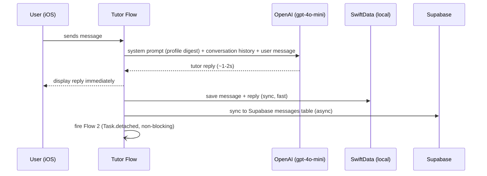
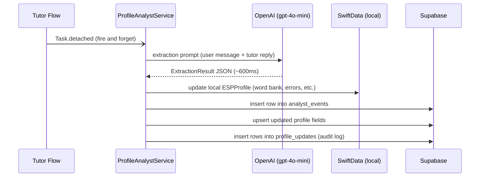
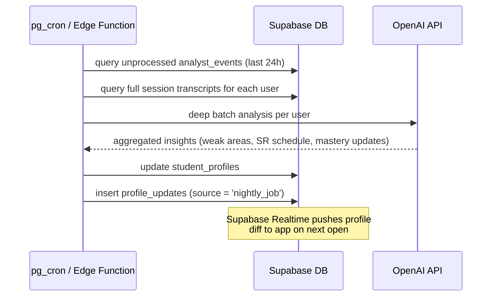

# Professor Madrid — System Architecture

## Overview

Three independent flows with clearly separated responsibilities.
The student never waits for anything except the tutor reply.
Everything else runs after the fact, in the background, or on the server.

---

## Flow 1 — Tutor (Blocking, User-Facing)



**Responsibilities:** Teaching only. No extraction, no analysis, no profile updates.

**System prompt contains:** Compact profile digest (SR words due today, recent errors, life context, current focus). Read-only. The tutor does not write to the profile.

**Latency target:** < 2 seconds to first display.

---

## Flow 2 — Analyst (Background, iOS Device)



**Responsibilities:** Extract structured insights from each exchange. Update local profile. Ship everything to Supabase for backend visibility.

**Does NOT block the user.** Runs concurrently. If the app closes mid-run, the raw messages are already in Supabase and the nightly job will process them.

**Latency:** 600ms–2s. Irrelevant to UX.

---

## Flow 3 — Nightly Job (Server-Side, Scheduled)



**Responsibilities:** Aggregate insights across full conversation history. Recalculate spaced repetition schedules. Detect persistent weak areas. Update mastery levels. Push to app via Realtime.

**This is what enables server-side intelligence** — the nightly job sees patterns across 30 sessions that the per-message analyst cannot see.

---

## Storage Layers

| Layer | Technology | Role |
|---|---|---|
| **Device operational DB** | SwiftData | Fast reads for app UI. Offline capable. Messages, sessions, profile cache, word bank, parrot phrases. |
| **Cloud DB** | Supabase (Postgres) | Source of truth for analytics, cross-device sync, nightly processing, observability. |
| **Cloud Realtime** | Supabase Realtime | Pushes profile updates from nightly job back to the app without polling. |
| **LLM** | OpenAI gpt-4o-mini | Used by both Tutor flow and Analyst flow. Separate calls, separate prompts. |

---

## Service Boundaries

```mermaid
graph TD
    subgraph iOS Device
        TutorFlow["Tutor Flow\n(ChatOpenAIService)"]
        AnalystFlow["Analyst Flow\n(ProfileAnalystService)"]
        LocalDB[(SwiftData)]
        TutorFlow -->|saves| LocalDB
        TutorFlow -.->|Task.detached| AnalystFlow
        AnalystFlow -->|updates| LocalDB
    end

    subgraph OpenAI
        LLM["gpt-4o-mini"]
    end

    subgraph Supabase
        MessagesTable[(messages)]
        ProfilesTable[(profiles)]
        AnalystEvents[(analyst_events)]
        ProfileUpdates[(profile_updates)]
        NightlyJob["Nightly Job\n(pg_cron / Edge Function)"]
        Realtime["Realtime"]
    end

    TutorFlow -->|query| LLM
    AnalystFlow -->|query| LLM
    TutorFlow -->|sync| MessagesTable
    AnalystFlow -->|insert| AnalystEvents
    AnalystFlow -->|upsert| ProfilesTable
    AnalystFlow -->|insert| ProfileUpdates
    NightlyJob -->|reads| AnalystEvents
    NightlyJob -->|reads| MessagesTable
    NightlyJob -->|updates| ProfilesTable
    NightlyJob -->|inserts| ProfileUpdates
    ProfilesTable -->|change event| Realtime
    Realtime -->|profile refresh| iOS Device
```

---

## Design Principles

**1. Tutor flow must never wait for analysis.** The student should never experience latency from profile updates.

**2. Everything gets logged to Supabase.** Every exchange, every analyst result, every profile change. When real users are using the app, there is no device log access. Supabase is the only window into what the system is doing.

**3. The tutor prompt is read-only.** It consumes the profile digest but never writes back. Profile updates happen exclusively via the Analyst flow and Nightly Job.

**4. Graceful degradation.** If the analyst task fails or the app closes, nothing breaks. The tutor still works. The raw messages are in Supabase. The nightly job processes them later.

**5. Device DB is the cache, Supabase is the truth.** On cold launch, the app fetches the latest profile from Supabase and updates local cache. Local reads are fast; remote writes are async.
