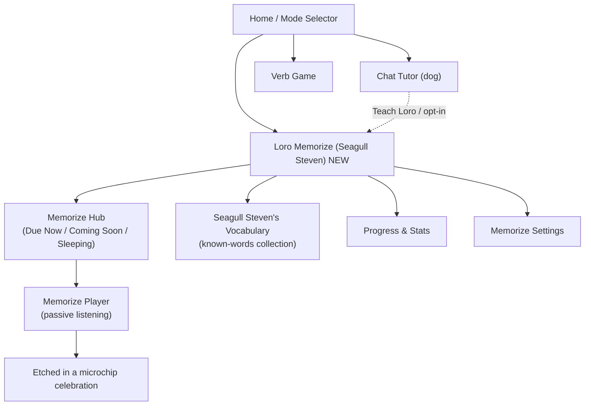

# Loro Memorize — Complete SRS Feature Specification

**Version:** 2.0 (full rewrite incorporating gap analysis)
**Replaces:** original `srs-memorization-system.md` (algorithm-only v1)

---

## How to Read This Document

This specification answers three questions:

1. **What the engine does** — the 13-step spaced-repetition algorithm, data model, scheduling rules, and play-update logic.
2. **What the user touches** — every screen, interaction, modal, notification, and gamification beat.
3. **Why it works** — the emotional spine ("teaching Seagull Steven to speak") and the scientific basis.

The original spec was an excellent algorithm definition. This version keeps that foundation and adds the ~70% that was missing: the character, the screens, the notifications, the edge cases, and the complete product experience.

---

## 0. Executive Summary — The Loro Memorize Feature

**Loro Memorize** is the app's third pillar alongside Chat Tutor and Verb Game. Its premise:

> *Professor Madrid teaches* **you**. *You teach* **Seagull Steven**. When a word finishes its SRS journey, **Seagull Steven knows it forever — and so do you.**

This chain (Madrid → You → Loro) is the product's unique emotional position. The algorithm is a 13-step spaced-repetition ladder, but the user never sees a ladder. They see a parrot learning to speak, word by word, each word becoming harder and harder to forget — written first in water, and eventually etched in a microchip.

---

## 1. Integration Decisions (Architectural Foundation)

### 1.1 Three competing models — reconciled

Three systems described "a word being learned." This spec freezes the reconciliation:

| System | Role | Audio | Scheduler |
|---|---|---|---|
| **`WordEntry` / `PhraseEntry`** (`profiles.word_bank`) | Word meaning, translation, SM-2 internal signal | none | SM-2 (read-only for tutor; not the passive-scheduler) |
| **`MemoryCard`** (this spec) | Passive-listening scheduler — the spine of Loro Memorize | 7 local WAV segments (the 7-part construction) | Fixed 13-step ladder (this document) |
| **`ParrotPhrase`** (shipped code) | On-demand per-message parrot audio | 7 local WAV segments | None (on-demand loops) |

**Binding decisions:**

- `MemoryCard` is the **passive scheduler**. It owns `next_due_at` and `exposure_count`.
- It **links to, not duplicates**, existing entities via `sourceWordId` / `sourceParrotId`.
- **Audio is a 7-segment set** (`audioSegmentPaths: [String]`), mirroring `ParrotPhrase.segmentPaths`. There is no single `audio_url`.
- **SM-2** stays an internal signal that feeds gate/priority decisions. It does not drive a second visible due date.
- Card sourcing: **chat-only, completion-gated.** A `MemoryCard` is created automatically when a user completes a full ParrotService session in chat. There is no separate "Teach Loro" entry point and no way to create a card from scratch. See §1.4 for the full creation pipeline.

### 1.2 Storage split — device-first, Supabase for stats only

Audio and scheduling logic stay on-device. Nothing audio-related is pushed to the server.

| Layer | What lives there | Why |
|---|---|---|
| **SwiftData (device)** | `MemoryCard` records, `audioSegmentPaths` bytes, scheduling/trigger logic, repetition state | Audio bytes would blow up server storage; scheduling must work offline |
| **Supabase `memory_cards` table** | Queue and playback statistics only — no audio bytes. Events: scheduled (`next_due_at` set, phase, planned `repetitions_this_phase`), played, skipped/snoozed, status transitions. | Lightweight monitoring and analytics; cross-device reconciliation via max-merge (§11 E13) |

Conflict resolution for multi-device: merge on `max(exposureCount)` + `latest(lastPlayedAt)` via `SupabaseSyncService`.

### 1.3 MemoryCard creation pipeline — ParrotService as the gate

A `MemoryCard` is born at the **end** of a completed ParrotService session, never before it.

**Flow:**

1. User taps the parrot icon on any chat message — the existing ParrotService starts.
2. ParrotService generates the 7 audio segments and begins looping them (1×, 4×, 10×, 20×… — user's choice).
3. **If the user completes the full loop run** (all chosen repetitions finish playing):
   - A toast/banner fires: *"This phrase went to Loro's memory."*
   - The app creates a `MemoryCard` from the `ParrotPhrase` artifact:
     - `audioSegmentPaths` = the 7 segment paths already on disk
     - `sourceParrotId` = the `ParrotPhrase.id`
     - `repetitionsPerPhaseBase` = the loop count from this session (see §5.2)
     - `exposureCount = 1` (this first completed session is exposure 1)
     - `nextDueAt` = now + 20 minutes (Learning 1 interval)
   - The `ParrotPhrase` and `MemoryCard` are **two independent records**. The phrase can still be replayed on-demand from chat; the card manages its own scheduled future.
4. **If the user exits before the loop run completes** — no `MemoryCard` is created. Nothing changes. The phrase remains a `ParrotPhrase` only.

**Why completion-gated?**
- A bad generation, an already-known phrase, or an interrupted session should not silently pollute the SRS queue.
- The user's act of listening all the way through is the signal that the phrase is worth remembering.

**What triggers on §4.1 `MemoryCard` from here** — `exposureCount` starts at 1 (not 0). The "unheard / Gate 1" state does not apply: the card has already been heard. `nextDueAt` is set immediately to Learning 1 interval. The card enters the queue 20 minutes later.

**Exact integration point in existing code:**
`LoopingParrotPlayer` (in `Chat/Audio/LoopingParrotPlayer.swift`) already sets `isDone = true` the moment all loops complete (in `advanceLoop()` when `currentLoop >= totalLoops`). `ParrotPlayerView` observes this player. The integration is a single `onChange(of: player.isDone)` in `ParrotPlayerView` that, when `isDone` becomes `true`, calls `MemoryCardService.createCard(from: phrase, loops: player.totalLoops)`.

`player.totalLoops` is the exact loop count the user chose from the selector (1, 2, 4, 6, 8, 10, or 20) — this becomes `repetitionsPerPhaseBase`.

**Source root:** All code lives under `EMOMORENEISA/EMOMORENEISA/EMOMORENEISA/` within the Xcode project. The docs folder is at the repository root (`docs/`), not inside the source tree.

---

### 1.4 `near_term_load` — now a user-editable setting

`max_near_term_load` is **not a hardcoded constant** (original spec: 40). It is captured in the Memorize settings (§10.1) and used as the "This week" bar ceiling in the capacity indicator (§5.3). The gate blocks new words when the user's chosen ceiling is hit.

---

## 2. Seagull Steven Character — Design Specification

### 2.1 Who Seagull Steven is

**Seagull Steven is a seagull wearing a parrot costume** — and he is very committed to the bit. This comedic mismatch is the character's signature and is load-bearing for the brand.

**Mandatory art-direction rules (apply to every Seagull Steven asset):**

- **Always full body, always with legs.** No head-only portraits or cropped frames. Complete character: head, beak, eyes, wings/arms, torso, legs, webbed feet. Everything fits inside the frame.
- **Seagull underneath, parrot on top.** Reads as a gull (gull body shape, webbed feet, gull beak peeking through) *wearing* a parrot costume (colorful fake plumage, clip-on parrot crest/wings, costume strap). The disguise is obviously a disguise.
- **Comedic tone.** Expressive, slightly ridiculous, endearing.
- **Transparent background (PNG/alpha).** Compositable over `AppBackground` and any screen.
- **High quality, consistent character.** Same seagull-parrot across all poses; only pose/expression changes.

**Seagull Steven does NOT evolve.** His appearance is identical at 1 word and at 500. Progress is a property of words (their material/horizon), not the bird.

### 2.2 Required pose set

| Pose | Used for |
|---|---|
| **Idle / breathing** | Memorize Hub (§5.2), idle loops |
| **Listening** | Player while audio plays (§6.1) |
| **Happy / celebrating** | "Etched in a microchip" moment (§3.2), milestones (§8.2) |
| **Excited / waving** | Notification deep-link landings, onboarding (§9.4) |
| **Teaching / co-teacher** | 100-word "Loro becomes co-teacher" beat (§8.2) |
| **Sleeping / napping** | "Nothing due" and vacation/pause empty states (§9.3) |
| **Sad / missing-you** | Lapse re-engagement (N5), welcome-back (E1) |

These assets are a **design/art dependency** for Phase 2 (§14) and must be produced before the metaphor, Vocabulary, and celebration screens can ship.

### 2.3 The two animals as co-teachers

| Character | Role | Tone | Where seen |
|---|---|---|---|
| **Professor Madrid** (dog) | The master teacher. He teaches the human. Source of authority. | Warm, witty, professorial | Chat tutor, home, milestone congratulations |
| **Seagull Steven** (seagull-in-parrot-costume) | The student you teach. Mirrors your progress. Knows only what you've taught him. | Eager, playful, a little cheeky | Memorize hub, player, vocabulary screen |
| **You (the user)** | The bridge. Madrid → You → Loro. Teaching down the chain is what makes it stick. | — | — |

**Onboarding narrative line:** *"Professor Madrid taught you this word. Now it's your turn to be the teacher. Say it to Seagull Steven enough times, and he'll know it for life — and so will you."*

---

## 3. The Five Memory Stages — Forgetting Horizon × Material

The 13 sub-phases (Learning 1–5, Review 1–5, Mature 1–3) are correct internally but are **never shown raw to the user.** They compress to 5 visible memory stages expressed as **how long Loro will remember the word** and **what material the word is written in**.

Progress is a property of words, not the bird. Seagull Steven never changes. Each word hardens from fragile to permanent.

### 3.1 Stage table

| Visible stage | Backend (`exposureCount`) | User-facing horizon label | Material (visual) |
|---|---|---|---|
| **1. Agua** (just taught) | 0–1 | *"Loro forgets in ~1 hour without practice."* | Written in **water** (evaporates instantly) |
| **2. Wood** (Learning) | 2–5 | *"…forgets in ~3 days."* | **Carved in wood** (can rot/warp) |
| **3. Stone** (Review) | 6–10 | *"…forgets in ~1 month."* | **Carved in stone** (stable) |
| **4. Gold** (Mature) | 11–12 | *"…forgets in ~1 year."* | **Cast in gold** (durable, precious) |
| **5. Microchip — Known!** (Archived) | 13 | *"Loro won't forget it for ~5 years."* | **Etched in a microchip** (permanent) |

This mapping (5 stages, 5 horizon labels, 5 materials) is the **only** phase language the user ever sees. "Learning 3" and "Mature 2" remain internal labels.

### 3.2 The signature moment — "Seagull Steven won't forget this one!"

Every time a card crosses `exposureCount >= 13` (the archive branch), fire the single most important moment in the feature:

1. The word token's material **transmutes to microchip** with a settling shimmer.
2. A warm Madrid line: *"¡Eso es! Loro won't forget this for years. That's word #48."*
3. Haptic success tap. Token slides into the Vocabulary collection.
4. Hero counter ticks up: **"Seagull Steven knows 47 → 48 words."**
5. Optional confetti only at milestone counts (§8.2) — otherwise quick, never blocking a passive session.

### 3.3 Micro-progression within a card

After each completed visit (all `repetitionsThisPhase` of the 7-part loop done):

- The word's material hardens one step and its forgetting horizon visibly extends.
- A thin per-card progress indicator (0–13, shown as the 5 material milestones) advances with a satisfying tick.
- Copy: *"2 more refreshers and Loro keeps this one for years."* (computed from `13 - exposureCount`).

### 3.4 Visual inventory required

- 5 material token states (Agua/water → Wood → Stone → Gold → Microchip) + transmutation transition between adjacent stages.
- Forgetting-horizon timeline strip — a compact horizontal strip of 5 labeled stops (1h · 3d · 1mo · 1yr · 5yr) with the word's current position lit.
- Forecasted-forgettingness table (§6.4).
- Per-card 13-step / 5-material progress indicator.

---

## 4. Data Model

### 4.1 MemoryCard (SwiftData, on-device source of truth)

```swift
MemoryCard {
    id: UUID
    content: String                   // the word or phrase text
    translation: String               // English meaning
    audioSegmentPaths: [String]       // 7 local WAV segments (replaces audio_url)
    sourceWordId: UUID?               // link to WordEntry if applicable
    sourceParrotId: UUID?             // link to ParrotPhrase if applicable

    exposureCount: Int                // 0–13; single source of truth for phase
    lastPlayedAt: Date?               // timestamp of most recent completed visit
    nextDueAt: Date?                  // computed after each visit; nil when newly created or archived
    isArchived: Bool                  // true when exposureCount >= 13

    repetitionsPerPhaseBase: Int      // configurable base X for phase-1 repetitions (default 5)
    createdAt: Date
}
```

**There is no session entity.** Every time a card's scheduled visit completes, the card is updated atomically and independently of everything else.

Phase and all derived values are computed, never stored. `repetitionsThisPhase` (how many 7-part loops this visit requires) is derived from `exposureCount` and `repetitionsPerPhaseBase`.

### 4.2 Supabase `memory_cards` table (stats and queue mirroring — no audio bytes)

Lightweight mirror for analytics and cross-device reconciliation. Stores:

- Card metadata: `id`, `content`, `exposureCount`, `nextDueAt`, `isArchived`, `lastPlayedAt`
- Playback events: scheduled, played, skipped/snoozed, status transitions (phase advanced, archived, re-taught, deleted)
- `deviceId` for reconciliation
- **No `audioSegmentPaths` bytes** — paths may be stored as strings for reference, bytes stay on-device

---

## 5. The 7-Part Construction — What One "Play" Means

### 5.1 Definition

One **parrot repetition** = one full pass through the 7-part construction. The exact segment order is defined by `ParrotService.buildSegments(script:)` in `Chat/Parrot/ParrotService.swift`:

| Segment index | Content | Label shown in UI |
|---|---|---|
| 0 | Spanish phrase | "Spanish phrase" |
| 1 | English translation | "English translation" |
| 2 | Spanish phrase (repeat) | "Spanish × 1" |
| 3 | Spanish phrase (repeat) | "Spanish × 2" |
| 4 | Spanish phrase (repeat) | "Spanish × 3" |
| 5 | Full Spanish sentence 1 | "Sentence 1" |
| 6 | Full Spanish sentence 2 | "Sentence 2" |

All seven audio segments together = **one parrot repetition.** Scrubbing, a partial pass, or a manual extra replay is **not** a repetition.

**Audio files live on disk** in `ParrotPhrase.parrotDir(for: phrase.id)` — named `1.wav` through `7.wav`. `MemoryCard.audioSegmentPaths` references these same file paths; **no audio is duplicated or re-generated**. The TTS cost is paid once, at original ParrotService generation time.

### 5.2 Per-phase repetition decay

A card's scheduled visit requires `repetitionsThisPhase` full 7-part loops before it advances. This count decays as memory stabilizes:

```
Phase 1 (just taught):     X loops   (X = the loop count from the originating ParrotService session)
Each subsequent phase:     round(previous × 0.7), clamped to minimum 1

Example (X=10 from a 10× ParrotService run): 10 → 7 → 5 → 4 → 3 → 2 → 1 → 1 → …
Example (X=4  from a 4×  ParrotService run):  4 → 3 → 2 → 1 → 1 → 1 → …
```

**Why inherit from the ParrotService session?**
The user revealed their natural drilling depth by choosing how many loops to play. That revealed preference is a better Phase 1 calibration than any fixed default. A user who looped 20× clearly needs more initial reinforcement; a user who completed 1× is likely already familiar with the phrase.

`repetitionsThisPhase` is derived on demand from `exposureCount` and `repetitionsPerPhaseBase`. It is never stored.

### 5.3 What counts as a completed visit

A **scheduled visit** completes — and `exposureCount` advances by one — only when the required `repetitionsThisPhase` count of full 7-part passes finishes. This disentangles three loop concepts:

| Concept | Definition | Counts toward schedule? |
|---|---|---|
| **7-part construction** | One full repetition (1 EN + 3 ES word + 2 ES sentences) | — |
| **`repetitionsThisPhase`** | Scheduled repetitions per visit, decaying ×0.7 | Yes — must all complete |
| **Manual 1×–20× loop multiplier** | Extra user drilling, independent of schedule | No |

A visit interrupted before all `repetitionsThisPhase` loops complete does **not** increment `exposureCount` (§11 E5, E12).

---

## 6. Phase Definitions and Scheduling

### 6.1 Phase table

Phase is derived from `exposureCount`. It is never stored.

| Phase | Play # | Min interval before next visit | Rationale |
|---|---|---|---|
| New | 0 | — | Just created, audio not yet played |
| Learning 1 | 1st play | 20 minutes | Same-session reinforcement |
| Learning 2 | 2nd play | 2 hours | Same-day reinforcement |
| Learning 3 | 3rd play | 8 hours | End-of-day consolidation |
| Learning 4 | 4th play | 1 day | Next-day reinforcement |
| Learning 5 | 5th play | 2 days | Early spacing begins |
| Review 1 | 6th play | 4 days | |
| Review 2 | 7th play | 7 days | |
| Review 3 | 8th play | 14 days | |
| Review 4 | 9th play | 30 days | |
| Review 5 | 10th play | 60 days | |
| Mature 1 | 11th play | 90 days | |
| Mature 2 | 12th play | 180 days | |
| Mature 3 | 13th play | 365 days | Final phase — card archived after this |

### 6.2 Interval table (implementation reference)

```swift
let phaseIntervals: [TimeInterval] = [
    20 * 60,           // Learning 1  — 20 min
    2 * 3600,          // Learning 2  — 2 hours
    8 * 3600,          // Learning 3  — 8 hours
    86400,             // Learning 4  — 1 day
    2 * 86400,         // Learning 5  — 2 days
    4 * 86400,         // Review 1    — 4 days
    7 * 86400,         // Review 2    — 7 days
    14 * 86400,        // Review 3    — 14 days
    30 * 86400,        // Review 4    — 30 days
    60 * 86400,        // Review 5    — 60 days
    90 * 86400,        // Mature 1    — 90 days
    180 * 86400,       // Mature 2    — 180 days
    365 * 86400,       // Mature 3    — 365 days (then archived)
]

func nextDueAt(exposureCount: Int) -> Date {
    guard exposureCount > 0, exposureCount <= phaseIntervals.count else { return Date() }
    return Date().addingTimeInterval(phaseIntervals[exposureCount - 1])
}

func repetitionsThisPhase(exposureCount: Int, base: Int = 5) -> Int {
    guard exposureCount > 0 else { return base }
    let decay = pow(0.7, Double(exposureCount - 1))
    return max(1, Int(round(Double(base) * decay)))
}
```

---

## 7. Play Event — Atomic Update

Every card update happens the moment a scheduled visit completes (all `repetitionsThisPhase` loops finished). No session flush, no batch write.

```swift
func onVisitDidComplete(card: inout MemoryCard) {
    card.exposureCount += 1
    card.lastPlayedAt = Date()

    if card.exposureCount >= 13 {
        card.nextDueAt = nil
        card.isArchived = true
        triggerMicrochipCelebration(for: card)
    } else {
        card.nextDueAt = nextDueAt(exposureCount: card.exposureCount)
    }

    save(card)
    emitPlaybackEvent(card: card)
}
```

The user can close the app at any point. Cards whose visits completed are saved. Cards whose visits did not complete are unchanged. No resumption logic needed — the queue is always freshly computed from card state.

---

## 8. Queue Construction

The queue is a live query — no queue entity is persisted. Computed on-device from SwiftData.

```swift
func buildQueue(sessionCap: Int = 20) -> [MemoryCard] {
    return MemoryCard
        .filter { !$0.isArchived && $0.nextDueAt != nil && $0.nextDueAt! <= Date() }
        .sorted { a, b in
            if a.exposureCount != b.exposureCount {
                return a.exposureCount < b.exposureCount
            }
            let aOverdue = Date().timeIntervalSince(a.nextDueAt!)
            let bOverdue = Date().timeIntervalSince(b.nextDueAt!)
            if abs(aOverdue - bOverdue) > 60 {
                return aOverdue > bOverdue
            }
            return Bool.random()
        }
        .prefix(sessionCap)
        .shuffledWithinSameUrgency()
}
```

**Ordering logic:** Learning before Review before Mature (by `exposureCount`). Most overdue within same phase first. Shuffle within same urgency to prevent sequence memorization (Kornell & Bjork, 2008).

---

## 9. Capacity Gates — Preventing Overload

New words cannot be added unless all three gates pass. Gates are checked in order; the first failure blocks creation.

```
Gate 1 (hard):  unheardCount == 0
                No word may be created if any card has exposureCount == 0.
                Enforce: hear everything you introduced before introducing more.

Gate 2 (hard):  activeLearningCount < maxActiveLearning   (default 20)
                Cards in Learning 1–5 (exposureCount 1–5).
                20 active learning cards = ~60–80 near-term plays.

Gate 3 (soft):  newTodayCount < dailyNewLimit   (default 5)
                Maximum N new cards per calendar day.
                Prevents motivated-day overload that creates weeks of backlog.

Gate 4 (soft):  nearTermLoad < maxNearTermLoad   (user-editable, default 40)
                Plays forecast for next 7 days. Prevents silent backpressure.
```

### 9.1 Derived metrics (computed on demand, not stored)

```
unheardCount         = COUNT(cards WHERE exposureCount == 0)
activeLearningCount  = COUNT(cards WHERE exposureCount BETWEEN 1 AND 5)
newTodayCount        = COUNT(cards WHERE DATE(createdAt, deviceLocalTimezone) == TODAY)
nearTermLoad         = COUNT of card-visits due in next 7 days (simulated from current state)
```

Daily reset is in **device-local midnight**. Gate-3 bar shows "resets in Xh." UTC is used for `nextDueAt` storage; device-local used only for "today" display.

### 9.2 Gate-failure messages (parrot voice)

| Gate failed | Inline message + affordance |
|---|---|
| Gate 1 | "🦜 Seagull Steven hasn't heard your last N words yet. Teach him those first → [Teach now]" |
| Gate 2 | "Loro's beak is full! Finish a few words before adding more. [See what's cooking]" |
| Gate 3 | "That's 5 new words today — Loro needs to sleep on them. Come back tomorrow 🌙" |
| Gate 4 | "Loro's weekly lesson is full. Finish some words first, or raise your limit in Settings." |

Gate messages render as **inline, non-blocking** messages under the disabled "+ Teach Loro" button — not modal sheets. Tapping the affordance deep-links to the relevant screen.

---

## 10. First Exposure Flow

When a user creates a new word or phrase via "Teach Loro":

1. Card created with `exposureCount = 0`, `nextDueAt = nil`
2. `unheardCount` increases — Gate 1 locks immediately
3. **First-exposure interstitial** (§15.2) auto-plays: the full 7-part construction, looped `repetitionsThisPhase(exposureCount: 0, base: X)` times. Cannot be silently skipped.
4. `onVisitDidComplete` fires: `exposureCount → 1`, `nextDueAt = now + 20 min`
5. `unheardCount` returns to 0 — Gate 1 unlocks
6. Card enters the queue automatically after 20 minutes
7. N1 notification scheduled if the user won't be in-app at the 20-minute mark

**Audio generation latency (C2):** `ParrotService.generate` takes seconds. While generating, show "Loro's voice is loading…" (reuse `generatingView` from `ParrotPlayerView`). The first-exposure interstitial only plays once audio is ready.

---

## 11. Information Architecture

### 11.1 Memorize in the app

Memorize is the **third pillar** alongside Chat Tutor and Verb Game.



- **Entry badge:** Memorize tile on home shows a live Due Now count badge ("5 ready") and the constant Seagull Steven. The badge carries the "something to do" signal; the bird stays constant.
- **Within Memorize:** 3-tab layout (Hub · Vocabulary · Progress) with Settings via a gear in the nav bar.

### 11.2 The Memorize Hub

- **Top:** the constant full-body Seagull Steven (idle pose, §2.2), plus "Seagull Steven knows 47 words" and a one-line status: *"5 words are about to fade — refresh them."*
- **Primary CTA:** a single large "Loro Memorize!" button (golden, brand accent color). This is the 90%-case action.
- **Capacity indicator** (§11.3) just under the CTA.
- **Three collapsible sections:**
  - **Due Now** — playable cards, each with material token + horizon label ("Stone · forgets in ~1 month") and per-card progress. Swipe actions: Snooze (U2), Skip (U1), more (U3–U5).
  - **Coming Soon (next 7 days)** — read-only, countdown ("fades in 3h unless refreshed") and current material/horizon.
  - **Sleeping (>7 days)** — read-only, collapsed by default, material/horizon + "safe until {date}."
- If Due Now is empty, section replaced by the "nothing due" empty state (§15.3).

### 11.3 Capacity indicator

Three slim labeled progress bars with parrot-flavored copy and color states (green/amber/red):

```
🪶 Teaching now      ████████░░░░  14 / 20   (Gate 2 — activeLearningCount / maxActiveLearning)
📅 This week         ██████░░░░░░  28 / 40   (nearTermLoad / maxNearTermLoad — user-set)
✨ New today         ██░░░░░░░░░░   2 / 5    (Gate 3 — newTodayCount / dailyNewLimit)
```

- The "This week" ceiling is the user's `maxNearTermLoad` setting (§16.1).
- Tapping a bar opens a plain-language explainer.
- The "+ Teach Loro a word" button is disabled with the relevant gate message inline whenever any gate fails.

---

## 12. Screen Specifications

### 12.1 The Memorize Player (passive listening)

The lock-screen-first, hands-free core experience. Reuses and extends `LoopingParrotPlayer`.

**On-screen layout:**
- Seagull Steven at top (full-body seagull-parrot, listening pose, §2.2) — no evolution state.
- Current word large (Spanish), translation below.
- **Karaoke word-by-word highlight** as the 7-part construction plays (reuse `originalMessageView` pattern from `ParrotPlayerView`).
- **Session progress:** "Word 3 of 12 due today" + thin bar across the full session.
- **Within-word progress:** "Repetition 2 of 4 this round" (`repetitionsThisPhase` count).
- **Material + horizon strip:** word's current material substance and "refresh this and Loro keeps it for ~1 month" (the 5-stop horizon strip from §3.4).
- **Controls:** play/pause, next word, previous word, 1×–20× manual loop multiplier (independent of schedule).
- **Inline card actions:** Snooze (U2), Skip (U1), "Loro already knows this" (U3).

**Critical passive behaviors:**
- A scheduled visit = all `repetitionsThisPhase` 7-part loops complete. Word then advances one phase (material hardens, horizon extends) and player auto-advances.
- **Auto-advance:** after one card's scheduled visit completes, automatically continue to the next due card.
- **Background + lock screen:** session continues screen-off. Now Playing shows the word, artwork = Seagull Steven (the seagull-parrot), next/prev mapped to skip-word. Extend `LoopingParrotPlayer`'s existing `MPRemoteCommandCenter` setup from single-phrase to a session queue.
- **Interruptions** (calls, Siri): pause gracefully; an interrupted visit does not count (U13).
- **Route change** (unplug headphones): pause on `routeChangeNotification`.
- **End-of-session screen:** warm summary — "You refreshed 12 words today. 2 of them are now set for years 🎉" + streak update + CTA back to Hub.

### 12.2 Seagull Steven's Vocabulary

The achievement collection screen where progress lives in the words, not the bird.

- **Constant Seagull Steven, hero-sized** (perched, idle pose, §2.2) — he does not evolve.
- **Hero metric + sub-stats:** "Knows 47 (microchip) · Almost there 6 (gold) · Still fragile 14 (agua/wood/stone)."
- **Word collection as materials:** a flowing grid (reuse `FlowLayout.swift`) of every word as a **token in its current material** (Agua → Wood → Stone → Gold → Microchip). Tapping a token replays it (U9, non-counting) and shows its forgetting horizon + last refreshed.
- **Filter/sort:** by material/durability, date learned, alphabetical, by topic.
- **Share card:** "Seagull Steven knows 47 Spanish words 🦜" image for social.
- **Search** his vocabulary.

### 12.3 Progress & Stats Dashboard

Scrollable, mobile-first cards:

- **Top card:** hero metric + streak flame + "this week" sparkline.
- **Pipeline card:** 5-segment stacked bar (Agua 1h → Wood 3d → Stone 1mo → Gold 1yr → Microchip 5yr) showing count at each horizon. Tapping a segment filters the Hub.
- **Forecasted-forgettingness table** (new — explicitly requested): per-word table of *"when will Loro forget this if I do nothing,"* sorted soonest-first. Columns: word · current material · **fades on {date/relative}** ("in 2h", "in 4 days", "in 3 weeks") · last refreshed. Grouped by horizon bucket (not a to-scale chart — horizons span 1 hour to 5 years).
- **Activity card:** 7/30-day plays bar chart + total minutes listened.
- **Forecast card:** "Next 7 days: ~34 reps" (uses `nearTermLoad` against user's ceiling) — warns before an avalanche.
- **Milestones card:** next badge progress ("3 words to 'Loro Knows 50!'").

All numbers computed on demand from card state — no stored counters except streak bookkeeping.

---

## 13. Use Cases — Complete Matrix

### 13.1 Card and queue management

| # | Use case | Effect on state | Notes |
|---|---|---|---|
| U1 | **Skip a card this session** | Push to back of session queue | Does NOT increment `exposureCount` |
| U2 | **Snooze a card** | Advance `nextDueAt` by user-chosen interval (e.g. +1 day) | Distinct from skip; persisted |
| U3 | **"Loro already knows this"** | Jump card to archived, or advance several exposures | Confirm modal; power-user escape valve |
| U4 | **Delete a card** | Remove from system entirely | Confirm modal. Frees Gate 2 slot. |
| U5 | **Edit a card** | Fix text/translation; optionally regenerate audio via `ParrotService.generate` | — |
| U6 | **Re-teach an archived word** | Bring "known" word back into rotation | Reset to Review-tier (e.g. exposureCount 6), not to 0. "Loro forgot? Re-teach him." |
| U7 | **Clear/dismiss the whole due queue** | Mark session done without playing all | Does not falsify plays; dismisses badge |
| U8 | **Manually add a word to Memorize** | From chat, word bank, or "+ Teach Loro a word" entry | Tied to D1 card-sourcing decision |
| U9 | **Replay a card without counting** | No state change | "Just listen again" — prevent double-counting |
| U10 | **Reorder / prioritize** | Pin a word to front of queue | Optional power feature |
| U11 | **Bulk teach (batch first-exposure)** | Play all unheard words back-to-back, clearing Gate 1 in one sitting | Interacts with Gate 1 |
| U12 | **Vacation mode / pause** | Freeze all `nextDueAt` advancement | Confirm modal explains consequences; empty state (§15.3) |
| U13 | **A completed visit** | `exposureCount += 1`, `nextDueAt` set | Only fires when all `repetitionsThisPhase` full 7-part loops complete. Scrubbing, partial pass, or manual replay → does not count. |

---

## 14. Notifications

A passive SRS is functionally useless without notifications. Intervals stretch to hours, days, and months.

### 14.1 Notification types

| # | Trigger | Example copy | Cadence |
|---|---|---|---|
| N1 | **Daily due reminder** — cards in Due Now | "🦜 Seagull Steven is waiting — 6 words are ready for a lesson." | User-set time(s); default 1/day at a learned-good hour |
| N2 | **First-exposure / unheard nudge** (resolves Gate-1 deadlock) | "You taught Loro a new word but he hasn't heard you yet. Tap to teach him." | A few hours after a card is left at `exposureCount == 0` |
| N3 | **Streak keep-alive** | "Don't break your 7-day streak — Loro just needs 2 minutes." | Evening, only if no session today |
| N4 | **Milestone / word set for life** | "🎉 Seagull Steven now knows 50 words — and *poder* is etched in a microchip, safe for years." | Event-driven |
| N5 | **Lapse re-engagement** | "Seagull Steven misses you. 23 words are waiting — let's ease back in." | After N days inactive, escalating gently |
| N6 | **Avalanche / forgetting pre-warning** | "Heads up: 18 words start fading tomorrow. Refresh a few today so Loro keeps them?" | When nearTermLoad forecast spikes |
| N7 | **Weekly progress digest** | "This week you taught Loro 18 words and he learned 4 for life." | Weekly, opt-in |

### 14.2 Intelligence and guardrails

- **Smart timing:** learn the user's typical active hour from session history; schedule N1 there. Do not fire at midnight.
- **Quiet hours** and **max-per-day cap** (default 1–2) in settings.
- **Batching:** never one notification per due card — always aggregate ("6 words ready").
- **Do not notify for 20-minute Learning-1 intervals** unless the app is foregrounded — would be spammy.
- **Permission priming:** ask for notification permission *after* the user's first "word set for life" moment, not on cold launch.
- **Deep links:** N1/N3 → Player with queue; N4 → Vocabulary celebration; N2 → first-exposure flow.

---

## 15. Modals, Empty States, and Onboarding

### 15.1 Required modals and sheets

| Modal | When | Behavior |
|---|---|---|
| **First-exposure interstitial** | After creating a card | Auto-plays first scheduled visit (full 7-part × `repetitionsThisPhase` loops); cannot be silently skipped |
| **"Etched in a microchip" celebration** | `exposureCount` reaches 13 | Overlay, auto-dismiss, haptic, word transmutes material |
| **Milestone celebration** | 10/25/50/100/250-word badges | Bigger overlay + share prompt |
| **End-of-session summary** | Session completes | Warm summary + streak + Hub CTA |
| **Confirm-delete** | U4 | Destructive confirmation |
| **Confirm "Loro already knows this"** | U3 | Skip-ahead confirmation |
| **Vacation/pause confirmation** | U12 | Explains what freezing does |
| **Notification-permission priming** | After first "Microchip" word | Contextual permission request |

### 15.2 Empty states

| State | When | Design |
|---|---|---|
| **Cold start** | First ever visit, no cards | Seagull Steven (full-body seagull-parrot, excited pose) + onboarding CTA: "Meet Seagull Steven. Teach him your first Spanish word." |
| **Nothing due right now** | Queue empty, cards exist | Seagull Steven (sleeping pose): "Loro's resting — nothing's about to fade. Next refresh in 3h." + forecasted-forgettingness preview + Vocabulary CTA. This is a **good state** — celebrate it. |
| **All mastered** | Every card archived | Seagull Steven (happy pose) + a shelf of microchip word tokens: "Seagull Steven knows everything you've taught him. Teach him something new?" |
| **Paused (vacation)** | System frozen | Seagull Steven (sleeping pose): "Loro's on holiday 🌴 — tap to wake him when you're ready." |

### 15.3 Feature onboarding (first-run, shown once)

A short, skippable 3–4 step intro the first time the user opens Memorize:

1. **Meet Seagull Steven** — "Professor Madrid taught *you*. Now *you* teach Seagull Steven."
2. **How teaching works** — "Each word starts written in water — Loro forgets it in an hour. Refresh it and it hardens: wood, stone, gold… until it's etched in a microchip and he won't forget it for years." (Shows the Agua→Microchip material/horizon timeline in one animation.)
3. **It's automatic** — "We'll tell you exactly when a word is about to fade. Just tap play before Loro forgets." (Sets up notifications value prop.)
4. **Teach your first word** — drops them into first-exposure with a starter word or their existing word bank.

Re-accessible from Settings.

---

## 16. Settings

### 16.1 Memorize settings screen

| Setting | Type | Default | Notes |
|---|---|---|---|
| **Daily new-word limit** (Gate 3) | stepper 1–10 | 5 | Main pace dial |
| **Max words in learning** (Gate 2) | stepper / off | 20 | Power setting; warn if raised |
| **Weekly load cap** (`maxNearTermLoad`) | stepper | 40 | User-editable backpressure ceiling; "This week" bar reads against this |
| **Session size cap** | stepper | 20 | Cards per "Loro Memorize!" trigger |
| **First-phase repetitions** (`repetitionsPerPhaseBase`) | stepper | 5 | How many 7-part loops when a word is brand new; later phases auto-decay ×0.7, min 1 |
| **Default loop multiplier** | 1×–20× | 1× | Manual extra drilling, independent of schedule |
| **Auto-advance in session** | toggle | on | Hands-free passive mode |
| **Reminder time(s)** | time picker(s) | 1 smart default | Drives N1 |
| **Quiet hours** | range | 22:00–08:00 | |
| **Notification types** | per-type toggles | N1/N3/N4 on | Maps to §14.1 |
| **Vacation / pause** | toggle + date | off | Freezes scheduling (U12) |
| **Audio voice / speed** | picker | brand default | Ties to `ParrotService` |
| **Reset Loro's progress** | destructive | — | Double-confirm; archive vs. wipe choice |
| **Replay onboarding** | action | — | Re-shows first-run flow |

---

## 17. Gamification and Incentives

### 17.1 The core loop

**Refresh → words harden → you see them turn from water toward a microchip → you come back before they fade.** Every session visibly advances at least one of: a word's material, the streak, or (the jackpot) a word reaching "Microchip." There must never be a session where "nothing happened."

### 17.2 Vocabulary milestones (Seagull Steven does NOT change)

Seagull Steven's appearance does not evolve. Milestones are **named badges on the vocabulary count:**

| Words known (Microchip tier) | Badge | Moment |
|---|---|---|
| 0 | — | Onboarding start |
| 10 | "Loro Speaks!" | First "this is really working" payoff |
| 25 | "Chatty Loro" | |
| 50 | "Fluent Wings" | Big confetti moment + share prompt |
| 100 | "Professor Loro" | Loro becomes a co-teacher — narrative beat, badge + copy, no visual re-skin |
| 250+ | "Maestro Loro" | Long-tail goal |

At 100 words, Seagull Steven graduates from student to co-teacher: *"You taught Loro so well, now he can help teach new words."* This is a narrative/badge beat, not a visual mutation.

### 17.3 Secondary mechanics

- **Streaks (S3):** daily flame, with one **streak-freeze** ("Loro nap day") to forgive a single miss and reduce churn-on-break.
- **Achievements/badges:** first word, 7-day streak, "taught 5 words in a day," "100% of this week's reps," topic-completion.
- **Daily goal:** "teach Loro for 2 minutes" — passive-friendly, time-based not count-based.
- **Collection completion:** topic sets ("Loro knows 8/10 travel words") create Zeigarnik pull.
- **Share cards** (§12.2) for milestones.

### 17.4 Anti-patterns to avoid

No lives/hearts that punish, no aggressive guilt, no pay-to-progress, no leaderboards by default. The reward is the relationship with Loro and visible competence. Keep celebrations warm and brief.

---

## 18. Edge Case Handling Matrix

| # | Edge case | What breaks if ignored | Designed handling |
|---|---|---|---|
| E1 | **User away 2 weeks → backlog avalanche** | 100+ cards all due; wall of work → guilt → churn | **Welcome-back flow:** cap session, show "Loro missed you! N words need a quick refresher," prioritize most-overdue Learning cards, offer "ease back in: just 10 today." Never punish. |
| E2 | **Queue larger than session cap** | Other due cards invisible; user thinks done when not | End-of-session offers "N more are ready — keep going?" Hub shows true Due-Now count. |
| E3 | **Gate-1 deadlock** (card stuck at `exposureCount == 0`) | New-word creation permanently locked | Auto-play first exposure on creation; N2 nudge; first-exposure interstitial impossible to miss; allow unheard card to be heard from the gate message directly. |
| E4 | **Audio fails / offline** | Card can't play; session stalls | Pre-cache audio at creation. At play time: skip gracefully, queue regeneration, show "Loro's voice is loading." Offline: play cached cards only; banner "Reconnect to teach new words." An unplayed rep does not count. |
| E5 | **App closed mid-session / mid-play** | Partial state | Atomic per-play save handles this. A rep interrupted before full completion does not increment. Relaunch recomputes queue fresh. |
| E6 | **All cards archived** | Empty feature | "All mastered" empty state + prompt to teach new or re-teach (U6). |
| E7 | **Zero cards (cold start)** | Blank feature | Cold-start empty state + onboarding (§15.3). |
| E8 | **Device clock change / timezone travel** | `nextDueAt` math breaks; user could game intervals | Use UTC for storage. Compute "today" in device-local. Tolerate clock jumps by clamping negative intervals to "due now." Do not reward backward clock changes. |
| E9 | **Daily-new-count midnight reset ambiguity** | Gate 3 resets at unclear time | Reset at device-local midnight. Show "resets in Xh" on the Gate-3 bar. |
| E10 | **Very long phrase** | Audio long; UI overflow | Cap phrase length at creation. Truncate display with expand. Karaoke scrolls. |
| E11 | **Duplicate word created** | Two cards, double drilling | Detect on creation; offer "Loro's already learning this — go to it." |
| E12 | **User scrubs / partial listen** | Inflated `exposureCount` | Only a full 7-part pass counts (U13). Scrubbing and manual replays are non-counting (U9). |
| E13 | **Multi-device concurrent play** | `exposureCount` conflict | Prefer `max(exposureCount)` merge + `latest(lastPlayedAt)` via `SupabaseSyncService`. Last-write-wins unsafe. |
| E14 | **Huge vocabulary (500+ tokens)** | Vocabulary screen perf | Lazy grid, sectioning, search. Archive view paginates. |
| E15 | **Notifications denied** | User never learns cards are due | In-app badges + home Due-Now badge carry the load. Periodic soft prompt tied to a felt benefit. |
| E16 | **Mass first-exposure (U11) vs Gate 1** | User adds 5, must hear all before more | Bulk-teach session plays all unheard back-to-back, clearing Gate 1 in one sitting. |
| E17 | **Card content offensive/wrong** | User stuck with a bad card | Delete (U4) + edit/regenerate (U5) always reachable via swipe and card detail. |

---

## 19. Accessibility, Background Audio, and Platform Behaviors

Because this is a passive audio feature for people on the move, platform behaviors are not optional polish — they are the feature.

- **Background and lock-screen playback:** require the `audio` background mode. `LoopingParrotPlayer` already configures `AVAudioSession(.playback)`, `MPNowPlayingInfoCenter`, `MPRemoteCommandCenter` — extend from single-phrase to **session queue** (next/prev = next/prev word, Now Playing shows the current word + Seagull Steven artwork, the seagull-parrot §2.2).
- **Interruptions and route changes:** handle `AVAudioSession.interruptionNotification` (calls, Siri) and `routeChangeNotification` (unplug headphones → pause). Interrupted visits don't count.
- **CarPlay / commute:** at minimum, robust Now Playing controls. Future CarPlay audio app surface given the running/commute persona.
- **VoiceOver:** every card, word token, and control labeled. Seagull Steven's art has a stable alt text. Each word token announces its material + horizon ("*poder*, cast in gold, safe for about a year").
- **Dynamic Type and one-handed reach:** primary actions in the bottom third. "Loro Memorize!" CTA thumb-reachable.
- **Haptics:** success haptic when a word reaches Microchip; light tick on per-card material/horizon advance.
- **Reduce Motion:** static fallbacks for material-transmutation and timeline animations.
- **Design system:** reuse `AppBackground`, `AppColors`, rounded system fonts, yellow/parrot accent. Memorize feels native to the existing app.

---

## 20. Scientific Basis

| Principle | Source | How it applies |
|---|---|---|
| Spacing Effect | Ebbinghaus (1885), hundreds of replications | Intervals grow longer as stability increases |
| Forgetting Curve | Ebbinghaus (1885) | Cards are replayed before memory fully decays |
| Passive exposure volume | Nation (2001), Webb (2007) | 13 total plays approximates the 10–15 exposures needed for incidental acquisition |
| Interleaving | Kornell & Bjork (2008) | Queue shuffles within phase to improve discrimination and prevent sequence memorization |
| Backpressure / load limiting | Cognitive load theory | Capacity gates prevent overwhelming working memory |
| Protégé effect / learning-by-teaching | Chase et al. (2009); Fiorella & Mayer (2013) | People who learn material *in order to teach it* encode it more deeply and recall it longer. "Teach Loro" reframes passive listening as an act of instruction. |
| Per-phase repetition decay | Spaced practice research | Massed repetition at early stages, spaced single-pass at mature stages — matches memory consolidation dynamics |

---

## 21. Open Product Decisions

These decisions gate design and should be resolved before Phase 1 build:

- **D1 — Card sourcing (highest impact):** Do all tutor-introduced words auto-become Memory Cards, or does the user opt words in? *Recommendation: opt-in by default with a one-tap "Teach Loro" on any chat word/phrase, plus an optional "auto-teach new words" setting.*
- **D2 — Model reconciliation:** Confirm `MemoryCard` is the passive scheduler, links to (not duplicates) `WordEntry`/`ParrotPhrase`, and uses segment audio. SM-2 stays an internal signal only.
- **D3 — Relationship to existing Seagull Steven:** Is "Loro Memorize" the same parrot the user meets per-message, or a parallel surface? *Recommendation: same parrot, unified — the per-message "tap the parrot" becomes "add to Loro's lessons."*
- **D4 — Re-teach semantics (U6):** When Loro "forgets," reset to which exposure tier? *Recommendation: Review-tier (exposureCount 6), not to 0.*
- **D5 — Server vs device scheduling:** Queue computed locally (SwiftData) or server-side? *This spec recommends device-first (§1.2).*
- **D6 — Does the 100-word "co-teacher" beat change any tutor behavior?** *Recommendation: purely narrative/badge for now.*

---

## 22. Phased Build Roadmap

### Phase 1 — Make it work (engine + minimum loop)

- Freeze the `MemoryCard` model (`audioSegmentPaths`, `repetitionsPerPhaseBase`, `repetitionsThisPhase`) and device-first persistence with stats-only Supabase mirroring.
- Card creation + first-exposure interstitial (Gate-1 deadlock fix), audio via existing `ParrotService` (7-part construction).
- 13-step scheduler + per-phase repetition decay + atomic play update.
- Memorize Hub (Due Now/Coming Soon/Sleeping) + queue Player reusing `LoopingParrotPlayer`, with auto-advance and background/lock-screen.
- Capacity gates (including user-set `maxNearTermLoad`) + inline gate messages.
- N1 daily due notification.

### Phase 2 — Make it stick (the metaphor + incentives)

- Seagull Steven character art (§2.2) — full-body seagull-in-parrot-costume pose set (7 poses, transparent backgrounds). Hard dependency for all screens below.
- 5 material/forgetting-horizon stages (Agua → Microchip) + per-card material/horizon indicator + timeline strip.
- "Etched in a microchip" celebration + hero metric.
- Seagull Steven's Vocabulary screen (material-token collection, constant Seagull Steven).
- Streaks + milestone notifications (N3/N4).
- Onboarding (§15.3) + four empty states.

### Phase 3 — Make it whole (management, stats, resilience)

- Card management actions U1–U13 (snooze/skip/delete/edit/re-teach/already-known).
- Progress & Stats dashboard (S1–S9) including the forecasted-forgettingness table.
- Settings screen (including user-editable weekly load cap and first-phase repetitions) + vacation mode.
- Welcome-back / avalanche flow (E1) + session overflow (E2) + lapse/forgetting notifications (N5/N6).
- Audio pre-caching/offline (E4), stats-event sync reconciliation (E13), clock-safety (E8/E9).

### Phase 4 — Make it spread (delight + retention long-tail)

- 100/250-word badge tiers + "Loro co-teacher" narrative beat (no Seagull Steven re-skin).
- Achievements/badges, topic collections, share cards.
- Smart notification timing, CarPlay consideration, weekly digest (N7).

---

## 23. Implementation Checklist

### Engine / data model
- [ ] `MemoryCard` SwiftData model with `audioSegmentPaths: [String]`, `exposureCount`, `nextDueAt`, `isArchived`, `repetitionsPerPhaseBase`, `sourceWordId`, `sourceParrotId`
- [ ] `onVisitDidComplete` atomic update function (fires when all `repetitionsThisPhase` loops complete)
- [ ] `nextDueAt(exposureCount:)` interval lookup
- [ ] `repetitionsThisPhase(exposureCount:base:)` decay formula
- [ ] Queue query (filtered, ordered, capped) — device-side from SwiftData
- [ ] Four capacity gate checks on word creation (Gate 1–4)
- [ ] Supabase `memory_cards` stats table + playback event emitter
- [ ] Multi-device `max(exposureCount)` merge reconciliation

### Audio
- [ ] Audio reuses 7-part segment set via `LoopingParrotPlayer` / `ParrotService` (no new audio pipeline)
- [ ] Per-phase repetition count controls session loop behavior
- [ ] Manual 1×–20× loop multiplier independent of schedule
- [ ] Audio pre-cached at card creation
- [ ] Graceful skip + regeneration on audio failure
- [ ] Offline mode: cached-only playback with banner

### Scheduling and gates
- [ ] Device-local midnight for daily reset (Gate 3)
- [ ] UTC storage for all `nextDueAt` timestamps
- [ ] Clock-jump tolerance (clamp negative intervals to "due now")
- [ ] `maxNearTermLoad` wired to user-editable setting (Gate 4 backpressure)
- [ ] Gate-failure inline messages in parrot voice with deep-link affordances

### First-exposure flow
- [ ] Card created at `exposureCount = 0`, Gate 1 locks immediately
- [ ] First-exposure interstitial auto-plays; cannot be silently skipped
- [ ] N2 nudge if card left at `exposureCount == 0` for several hours
- [ ] `ParrotService.generate` latency handled with "Loro's voice is loading…" state

### Player
- [ ] Queue Player extending `LoopingParrotPlayer` to a session queue (auto-advance)
- [ ] Background and lock-screen playback (audio background mode)
- [ ] Full `MPNowPlayingInfoCenter` / `MPRemoteCommandCenter` for session queue
- [ ] `AVAudioSession.interruptionNotification` and `routeChangeNotification` handling
- [ ] Within-word repetition progress ("Repetition 2 of 4") display
- [ ] End-of-session summary screen

### UI screens
- [ ] Memorize tile on Home with live Due-Now badge and constant Seagull Steven thumbnail
- [ ] 3-tab Memorize container (Hub · Vocabulary · Progress) + Settings gear
- [ ] Hub: collapsible Due Now / Coming Soon / Sleeping sections with swipe actions
- [ ] Capacity indicator (3 progress bars, tap-to-explain)
- [ ] Memorize Player with karaoke highlight, session progress, material/horizon strip, inline actions
- [ ] Seagull Steven's Vocabulary screen: material-token grid via `FlowLayout`, filter/sort/search/share
- [ ] Progress & Stats dashboard: pipeline bar, forecasted-forgettingness table, activity chart, milestones

### Character art (design/art dependency for Phase 2)
- [ ] Seagull Steven: 7 poses (idle, listening, happy, excited, teaching, sleeping, sad), full body with legs, transparent background, seagull-in-parrot-costume
- [ ] 5 material token states (Agua/water → Wood → Stone → Gold → Microchip) + transmutation transitions
- [ ] Forgetting-horizon timeline strip (5 labeled stops: 1h · 3d · 1mo · 1yr · 5yr)

### Notifications
- [ ] Local notification scheduling tied to `nextDueAt` and daily roll-up (N1)
- [ ] N2 unheard nudge (a few hours after `exposureCount == 0`)
- [ ] N3 streak keep-alive (evening, no session today)
- [ ] N4 milestone / microchip event-driven notification
- [ ] N5 lapse re-engagement (escalating after N days inactive)
- [ ] N6 avalanche pre-warning (when forecast spikes)
- [ ] N7 weekly digest (opt-in)
- [ ] Permission priming after first "Microchip" word
- [ ] Smart timing from session history, quiet hours, max-per-day cap, batching

### Gamification
- [ ] Archive celebration: material transmutation animation, Madrid copy, haptic, hero counter
- [ ] Streak tracking with one streak-freeze
- [ ] Vocabulary milestone badges (10/25/50/100/250 words)
- [ ] Milestone celebration overlay + share prompt
- [ ] 100-word "Professor Loro / co-teacher" narrative beat (badge + copy only, no art change)
- [ ] Topic-collection progress view

### Modals, empty states, onboarding
- [ ] First-exposure interstitial (resolves Gate-1 deadlock)
- [ ] Confirmation modals: delete (U4), skip-ahead (U3), vacation/pause (U12)
- [ ] Four empty states: cold start, nothing due, all mastered, paused
- [ ] 4-step onboarding carousel (shown once; re-accessible from Settings)

### Settings
- [ ] Memorize settings screen with all parameters in §16.1
- [ ] Vacation/pause mode with scheduling freeze
- [ ] Safe "reset progress" with explicit double-confirm

### Edge cases and platform
- [ ] Welcome-back flow (E1): cap + reframe, no punishment
- [ ] Session-cap overflow continuation (E2)
- [ ] Duplicate detection on card creation (E11)
- [ ] Max-phrase-length cap at creation (E10)
- [ ] Delete/edit always reachable (E17)
- [ ] Accessibility labels + Reduce Motion fallbacks on all new screens
- [ ] VoiceOver: word tokens announce material + horizon
- [ ] Haptic feedback on archive and per-card advance
